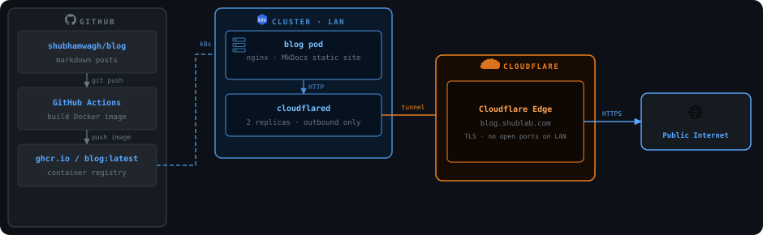

<p align="center">
  
  <h1 align="center">blog</h1>
  <p align="center"><strong>Building things, breaking things, writing it down.</strong></p>
  <p align="center">Live at <a href="https://blog.shublab.com">blog.shublab.com</a></p>
</p>

---

## How it is hosted

The blog runs self-hosted on a bare-metal k3s homelab and is publicly accessible via Cloudflare Tunnel - no ports open on the home network.

<p align="center">
  
</p>

## Writing a post

```bash
# create a new post
cd docs/posts
cp hello-world.md my-new-post.md
# edit, commit, push - GitHub Actions builds and deploys automatically
git add . && git commit -m "post: my new post" && git push
```

## Stack

- [MkDocs Material](https://squidfunk.github.io/mkdocs-material/) - static site generator
- [GitHub Actions](https://github.com/features/actions) - CI/CD, builds Docker image on push
- [ghcr.io](https://ghcr.io) - container registry
- [k3s](https://k3s.io) - lightweight Kubernetes
- [Cloudflare Tunnel](https://developers.cloudflare.com/cloudflare-one/connections/connect-networks/) - public exposure without open ports
- [giscus](https://giscus.app) - comments powered by GitHub Discussions
