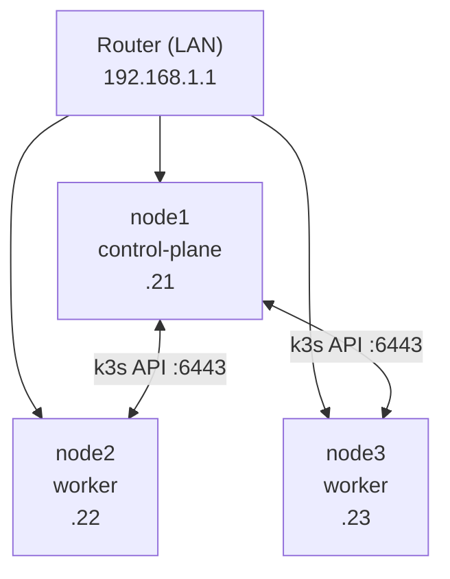

# Install k3s across 3 nodes

In the [previous post](/before-you-start-hardware--os-baseline/) we woke the metal: three mini PCs
with static IPs, SSH keys, and the boring-but-mandatory OS prep. Now the fun part — turning those
three boxes into one Kubernetes cluster.

If "install Kubernetes" sounds like a weekend of YAML and regret, good news: **k3s** is a
single-binary, certified Kubernetes distro that boots in seconds, and a tiny tool called
**k3sup** installs it over SSH so you never touch a node's console again. By the end of this
episode you'll have a working 3-node cluster and a `kubeconfig` on your laptop.

<!-- more -->

## What we're building (and why k3s)

"Kubernetes" usually conjures up a control-plane of five etcd nodes, a load balancer, and a
support contract. k3s throws most of that away: it's the same APIs, but packaged as one small
binary (~100 MB) with the heavy enterprise bits stripped out. For a homelab that's perfect — it
runs on a Raspberry Pi-class box and still speaks real Kubernetes.

The architecture we're aiming for:


*(all on 192.168.1.0/24 — illustrative; use your LAN)*

One node is the **control-plane** (it runs the API server + scheduler). The other two are
**workers** (they run your actual workloads). The workers "join" the control-plane over the k3s
API port (6443).

!!! info "Who is k3sup?"
    [k3sup](https://github.com/alexellis/k3sup) is a little Go tool from Alex Ellis. You run it
    from your laptop; it SSHes into each node, installs k3s, and writes a `kubeconfig` back to
    you. It's the difference between "I clicked through a GUI on every node" and "one command
    provisioned the whole cluster." You'll run k3sup directly with its own flags below — no
    wrapper or config repo needed.

## Step 0 — Get the tools on your laptop

You need three small binaries on the **control machine** (the laptop you SSH from):

- `k3sup`  — SSHes into each node and installs k3s
- `kubectl` — talks to the cluster
- `helm`   — installs Cilium from its chart a little later

Install them however you like (Homebrew, apt, a direct curl — it doesn't matter for the rest of
this episode). The direct path that works everywhere:

```bash
# k3sup
curl -sLS https://get.k3sup.dev | sh
sudo install k3sup /usr/local/bin/

# kubectl (Linux example; pick your arch)
curl -LO "https://dl.k8s.io/release/$(curl -L -s https://dl.k8s.io/release/stable.txt)/bin/linux/amd64/kubectl"
sudo install kubectl /usr/local/bin/

# helm
curl -fsSL https://raw.githubusercontent.com/helm/helm/main/scripts/get-helm-3 | bash
```

Verify all three are on your `PATH`:

```bash
k3sup version
kubectl version --client
helm version
```

## Step 1 — Tell k3sup about your nodes

k3sup doesn't need an inventory file or any config repo — it takes your nodes straight from the
command line. The cleanest way is to export a few shell variables once, then reuse them in every
command below. Use *your* LAN IPs and SSH user (these are just placeholders):

```bash
export CP_IP=192.168.1.21            # control-plane node
export WORKER1_IP=192.168.1.22       # worker 1
export WORKER2_IP=192.168.1.23       # worker 2
export SSH_USER=ubuntu               # the user you set up in episode 1
export SSH_KEY=~/.ssh/id_ed25519     # your SSH private key
export K3S_TOKEN=$(openssl rand -hex 16)   # shared secret workers use to join
```

That `K3S_TOKEN` is what lets workers prove they belong to the cluster. Generate it once and keep
it in your shell for the rest of this episode.

!!! tip "1-node? Put one IP in CP_IP, leave the workers unset"
    Building on a single mini PC first? Just set `CP_IP` and skip the worker exports. You'll get
    a perfectly valid single-node k3s. To grow to 3 later, export the worker IPs and run the
    `k3sup join` command from Step 2 for each new node — k3s joins them to the running cluster
    with no reinstall.

## Step 2 — Install the cluster

Four commands. That's the whole show.

**1. Initialise the control-plane:**

```bash
k3sup install \
  --host $CP_IP \
  --user $SSH_USER \
  --ssh-key $SSH_KEY \
  --k3s-extra-args "--cluster-init --token $K3S_TOKEN --tls-san $CP_IP \
    --write-kubeconfig-mode=644 \
    --disable=flannel,local-storage,metrics-server,servicelb,traefik \
    --flannel-backend=none --disable-network-policy \
    --disable-cloud-controller --disable-kube-proxy" \
  --local-path ~/.kube/config --context homelab-cluster --merge
```

**2. Join each worker** (loop over both, or run it once per node changing the host):

```bash
for W in $WORKER1_IP $WORKER2_IP; do
  k3sup join \
    --host $W \
    --user $SSH_USER \
    --ssh-key $SSH_KEY \
    --server-host $CP_IP --server-user $SSH_USER \
    --k3s-extra-args "--token $K3S_TOKEN"
done
```

**3. Point your kubeconfig at the real node.** k3sup writes `127.0.0.1` into the kubeconfig
server address (it assumes you run kubectl *on* the node). On macOS:

```bash
sed -i '' "s/127.0.0.1/$CP_IP/g" ~/.kube/config
```

On Linux, drop the empty `''` argument:

```bash
sed -i "s/127.0.0.1/$CP_IP/g" ~/.kube/config
```

**4. Install Cilium** (the networking layer) with Helm:

```bash
helm repo add cilium https://helm.cilium.io/
helm repo update
helm install cilium cilium/cilium \
  --namespace kube-system \
  --set kubeProxyReplacement=true \
  --set k8sServiceHost=$CP_IP \
  --set k8sServicePort=6443 \
  --set ipam.mode=cluster-pool
```

Give it a minute. Then confirm you can talk to the cluster:

```bash
kubectl get nodes -o wide
```

You're looking for three rows, all `Ready`:

```text
NAME    STATUS   ROLES                  VERSION        INTERNAL-IP
node1   Ready    control-plane,master   v1.32.x        192.168.1.21
node2   Ready    <none>                 v1.32.x        192.168.1.22
node3   Ready    <none>                 v1.32.x        192.168.1.23
```

## Why we turn k3s's built-in networking off

Two flags in that install command shape everything later, so they're worth a look:

- **`--disable=flannel,...,traefik --disable-kube-proxy --flannel-backend=none`** — we *deliberately*
  turn k3s's built-in networking (flannel), service load-balancer, and ingress (traefik) **off**.
  Why? Because we're going to install **Cilium** as the networking layer and **Traefik** as the
  ingress later, and running two of everything causes fights. Starting clean is the point.
- **`--cluster-init`** on the first control-plane — it tells k3s "you're the first server; others
  will join you." (We always pass `--cluster-init` to the init node — including a single-node
  cluster — so you don't toggle anything.)

!!! info "Going further: what Cilium actually does"
    The `helm install cilium` above deploys Cilium with `kubeProxyReplacement=true` and eBPF-based
    masquerade. In plain terms: Cilium handles pod networking, load-balancing, and network policy
    *in the Linux kernel* instead of via kube-proxy's iptables rules. That's faster and lets us do
    fancy things later (like giving a service a LAN IP). You don't need to understand eBPF today —
    just know it wired the cluster's networking in from minute one. Episode 3 goes deeper.

    (For reference: my own HomeOps repo wraps these exact steps in a `make bootstrap` target for
    repeat, automated runs — but you don't need it; the raw commands above are everything.)

## Verify before you celebrate

Don't trust the exit code — confirm the cluster is actually healthy:

```bash
kubectl get nodes -o wide
kubectl get pods -A          # system pods should be Running, not CrashLoopBackOff
cilium status --wait         # if you installed cilium-cli; otherwise skip
```

A healthy cluster: 3 `Ready` nodes, and the `kube-system` / `cilium` pods all `Running`.

## Common mistakes

- **Wrong SSH key path** — if k3sup can't authenticate, the install hangs or fails fast.
  Double-check `SSH_KEY` points at a key whose public half is on every node, and that
  `ssh -i $SSH_KEY $SSH_USER@$CP_IP` works from your laptop first.
- **Forgetting the worker IPs** — if you leave the workers unset by accident, you get a 1-node
  cluster and wonder why `kubectl get nodes` shows one row. Just export the worker IPs and run
  the `k3sup join` loop from Step 2 for the missing nodes.
- **Nodes not `Ready`** — 9 times out of 10 this is the OS baseline from the previous post:
  missing iSCSI (Longhorn will complain later, not now), or the host firewall fighting Cilium.
  Re-check ep1's Step 3.
- **Two networking stacks** — if you ever re-run the install without the `--disable` flags, you'll
  have flannel *and* Cilium both trying to own pod networking. That's a world of packet loss.
  Keep the `--disable` flags as shown.

## What's next

You have a real, multi-node Kubernetes cluster in your living room. But right now it's just
infrastructure with no *story* — no GitOps, no ingress, no apps. In [episode 3: networking with
Cilium + a load-balancer VIP] we'll go deeper on Cilium and give a service a real LAN IP so you
can reach it without port-forwarding gymnastics.

---

*Part of the [Homelab From Scratch (Hands-On Build)](/) series — start with [What's coming: build a
real homelab from 3 mini PCs](/start-here-a-hands-on-homelab-from-3-mini-pcs/), then
[Before you start: hardware + OS baseline](/before-you-start-hardware--os-baseline/).*
