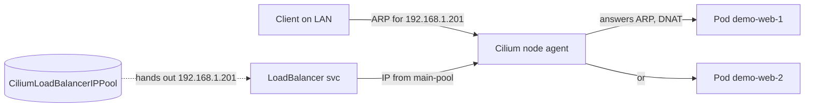

# Networking with Cilium + a load-balancer VIP

In [episode 2](/install-k3s-across-3-nodes/) you installed k3s across three nodes. If you
followed it exactly, your nodes have **no networking yet** — we installed k3s with
`--flannel-backend=none` on purpose, leaving the CNI slot empty. A cluster without a CNI is
just three lonely API servers; no pod can talk to another pod.

Today we fill that slot with **Cilium**, and unlock one of the nicest bare-metal tricks in the
whole series: giving a `LoadBalancer` Service a **real IP on your LAN** that other machines can
reach directly — no cloud provider, no port-forwarding gymnastics.

<!-- more -->

## What Cilium actually gives you

Cilium is a CNI (Container Network Interface) plugin built on **eBPF** — code that runs inside
the Linux kernel to handle networking, load-balancing, and security without bouncing through
userspace proxies. For our homelab it does three jobs:

- **Pod networking + IPAM** — assigns each pod an IP and routes pod-to-pod traffic.
- **kube-proxy replacement** — handles Kubernetes Service load-balancing in eBPF instead of
  iptables/kube-proxy (faster, and it's what makes the next trick work).
- **L2 load-balancer announcements** — makes a `LoadBalancer` Service answer on a real LAN IP.

!!! info "CNI in one sentence"
    The CNI is the thing that gives every container an IP and lets containers (and nodes) talk.
    Without it, pods stay in `ContainerCreating` forever because nothing wires up their network.

## Step 1 — Add the Cilium Helm chart

We install Cilium with Helm, the same package manager k3s-friendly projects use. This is a
normal `helm install` you run from your own machine against your own cluster — no repo-internal
tooling required.

```bash
helm repo add cilium https://helm.cilium.io/
helm repo update
```

## Step 2 — Write a values file

Create `cilium-values.yaml`. The two lines that matter for this episode are
`l2announcements.enabled: true` (lets Cilium answer ARP on the LAN) and `ipam.mode: kubernetes`
(let k3s assign pod IPs). The rest is the sensible default from a production-minded setup:

```yaml
# cilium-values.yaml
kubeProxyReplacement: true
# Cluster IP of the in-cluster "kubernetes" Service. 10.43.0.1 is the k3s default.
k8sServiceHost: "10.43.0.1"
k8sServicePort: 443
ipam:
  mode: kubernetes
bpf:
  masquerade: true
l2announcements:
  enabled: true
externalIPs:
  enabled: true
loadBalancer:
  algorithm: maglev
hubble:
  enabled: true
  relay:
    enabled: true
  ui:
    enabled: true
```

!!! warning "Match k8sServiceHost to YOUR cluster"
    `10.43.0.1` is the default Service ClusterIP for a stock k3s install. If you customized
    `--cluster-cidr` or your apiserver lives elsewhere, grab the real value first:
    `kubectl get svc kubernetes -n default -o jsonpath='{.spec.clusterIP}'`.

## Step 3 — Install Cilium

```bash
helm install cilium cilium/cilium \
  --version 1.17.3 \
  --namespace kube-system \
  --create-namespace \
  -f cilium-values.yaml
```

Give it a minute, then confirm the agents and operator are up:

```bash
kubectl -n kube-system get pods -l k8s-app=cilium
```

If you have the `cilium` CLI, the friendliest check is:

```bash
cilium status --wait
```

You should see `Cilium: OK` and every node `Ready`. Your cluster finally has a network.

## Step 4 — The LAN VIP: a LoadBalancer without a cloud

Here's the problem Cilium solves. A `LoadBalancer` Service is designed for cloud providers
(AWS/GCP/etc.) that provision an external IP for you. On bare metal there's no one to do that,
so the Service just sits in `pending` forever — *unless* something on your network answers ARP
for that IP and routes it to a pod.

Cilium does exactly that with two small CRDs:

1. **`CiliumLoadBalancerIPPool`** — a pool of LAN IPs Cilium is allowed to hand out.
2. **`CiliumL2AnnouncementPolicy`** — which node interfaces may announce those IPs on the LAN.

Create them as plain files and `kubectl apply`:

```yaml
# cilium-ip-pool.yaml
apiVersion: cilium.io/v2alpha1
kind: CiliumLoadBalancerIPPool
metadata:
  name: main-pool
spec:
  blocks:
    # Pick a FREE slice of YOUR LAN subnet. Example: 192.168.1.200/28
    # = 16 addresses (use a range your DHCP server will never assign).
    - cidr: "192.168.1.200/28"
  allowFirstLastIPs: "No"
```

```yaml
# cilium-l2-policy.yaml
apiVersion: cilium.io/v2alpha1
kind: CiliumL2AnnouncementPolicy
metadata:
  name: main-l2-policy
  namespace: kube-system
spec:
  interfaces:
    - enp.*
    - eno.*
    - eth.*
    - ens.*
  loadBalancerIPs: true
  externalIPs: true
```

```bash
kubectl apply -f cilium-ip-pool.yaml -f cilium-l2-policy.yaml
```

!!! warning "Choose a pool your DHCP server won't touch"
    A `/28` gives you ~13 usable IPs. The catch: if your router's DHCP range overlaps this
    block, two machines could end up claiming the same IP. Reserve the block in your router, or
    carve it out of a subnet DHCP doesn't hand out. Adjust `192.168.1.200/28` to whatever fits
    *your* `192.168.1.0/24` (or whatever subnet you used in episode 1).

## Step 5 — Prove it with a demo service

Spin up a throwaway nginx and expose it as a `LoadBalancer`:

```bash
kubectl create deployment demo-web --image=nginx --replicas=2
kubectl expose deployment demo-web --port=80 --type=LoadBalancer
kubectl get svc demo-web -w
```

Watch the `EXTERNAL-IP` column. Within a few seconds Cilium grabs the next free IP from
`main-pool` and one of your nodes starts answering ARP for it. You'll see something like:

```text
NAME        TYPE           CLUSTER-IP     EXTERNAL-IP     PORT(S)        AGE
demo-web    LoadBalancer   10.43.45.12    192.168.1.201   80:31234/TCP   8s
```

From **another machine on your LAN** (not the cluster), hit that VIP:

```bash
curl -sI http://192.168.1.201
```

A `200` from nginx means it worked: a pod inside Kubernetes just served a request addressed to a
plain LAN IP, with Cilium transparently routing it. Clean up the demo when you're done:

```bash
kubectl delete svc demo-web
kubectl delete deployment demo-web
```



## Common mistakes

- **Service stuck in `pending`** — you forgot `l2announcements.enabled: true`, or the IP pool
  isn't applied. Re-check both CRDs exist (`kubectl get ciliumloadbalancerippools`).
- **`EXTERNAL-IP` shows but curl times out** — the pool overlaps your DHCP range, or the L2
  policy's `interfaces:` globs don't match your actual NIC names (`ip -br addr` to check).
- **Pods still `ContainerCreating` after install** — Cilium didn't come up. Check
  `kubectl -n kube-system get pods -l k8s-app=cilium` and the agent logs.

## Going further

- **Hubble observability:** `kubectl port-forward -n kube-system svc/hubble-ui 12000:80` then
  open `http://localhost:12000` to watch live network flows as a service map.
- **eBPF kube-proxy replacement** (`kubeProxyReplacement: true` above) means you can even
  uninstall kube-proxy later — Cilium handles Service routing entirely in the kernel.
- **CiliumNetworkPolicy** lets you write real L3/L4 (and even L7) network policies — the
  foundation for the security hardening we'll touch in the final episode.

## What you have now

A working CNI and a cluster where any `LoadBalancer` Service gets a real, LAN-reachable IP for
free. That VIP is what Traefik, Longhorn, and every app we deploy later will hang off.

Next up: [episode 4: GitOps with Flux: let git run your cluster](/gitops-with-flux-let-git-run-your-cluster/) — we'll make the cluster
reconcile itself from a Git repo so none of this config is handwritten on a single node ever
again.

---

*Part of the [Homelab From Scratch (Hands-On Build)](/) series — continue from
[episode 2: install k3s across 3 nodes](/install-k3s-across-3-nodes/).*
