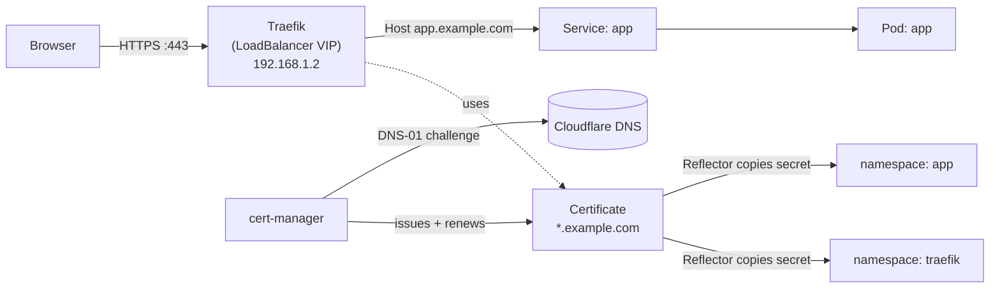

# Ingress + free TLS: Traefik & cert-manager

In [episode 4](/gitops-with-flux-let-git-run-your-cluster/) you made git the source of truth and
let Flux run the cluster. But right now your apps are unreachable from outside: a pod has a ClusterIP
nobody on your laptop can hit, and even if it could, it'd be plain HTTP.

Today we fix both at once. We install:

- **Traefik** — the ingress controller (the "front door" that routes outside traffic to the right
  service), and
- **cert-manager** — which talks to Let's Encrypt and mints **free, automatic TLS certificates**,

…then wire a **wildcard certificate** (`*.example.com`) through Cloudflare's DNS, and use **Reflector**
to copy that one cert into every namespace that needs it. Every object below is a file in your repo,
so Flux reconciles it just like everything else.

<!-- more -->

## Why an ingress controller at all?

A Kubernetes `Service` of type `ClusterIP` is only reachable *inside* the cluster. You could expose
each app with `type: LoadBalancer`, but then every app wants its own IP and its own cert, and you
have no central place to enforce HTTPS or auth.

An **ingress controller** solves this: you give Traefik *one* IP (the Cilium load-balancer VIP from
[episode 3](/networking-with-cilium--a-load-balancer-vip/)), point your DNS at it, and Traefik reads
rules ("host `app.example.com` → service `app`") and routes each request. **cert-manager** watches
for certificate requests and keeps them renewed. One door, one cert to manage, automatic HTTPS.



## The lay of the land (files you'll create)

We keep the three-layer layout from episode 4. The new files all live under
`infrastructure/production/networking/`:

```
infrastructure/production/networking/
├── traefik/
│   ├── namespace.yaml
│   ├── helmrepository.yaml
│   ├── helmrelease.yaml
│   ├── middleware-auth.yaml
│   └── ingress-dashboard.yaml
├── cert-manager/
│   ├── namespace.yaml
│   ├── helmrepository.yaml
│   ├── helmrelease.yaml
│   └── secret-cloudflare.example.yaml   # you create this (your token)
└── issuers.yaml                          # ClusterIssuer(s) + wildcard Certificate
```

And one small controller, Reflector, under `infrastructure/production/controllers/reflector/`.

Make sure a Flux `Kustomization` points at `infrastructure/production/networking` (your `infrastructure`
layer from episode 4). If you followed that episode, it already does.

!!! tip "Prefer Helm directly, without Flux?"
    Everything below is shown as Flux `HelmRelease` objects because this series is GitOps-first. If
    you'd rather install by hand just this once, the equivalent is: `helm repo add traefik
    https://traefik.github.io/charts && helm install traefik traefik/traefik -n traefik
    --create-namespace -f values.yaml` (same `values:` block), and likewise for cert-manager from
    `https://charts.jetstack.io`. Either path leaves you with the same running controllers.

## Step 1 — Install Traefik

A `HelmRepository` tells Flux where the chart lives, and a `HelmRelease` says "install it, with these
values." Traefik becomes the **default** ingress class and gets the Cilium VIP you reserved in episode 3.

```yaml
# infrastructure/production/networking/traefik/namespace.yaml
apiVersion: v1
kind: Namespace
metadata:
  name: traefik
```

```yaml
# infrastructure/production/networking/traefik/helmrepository.yaml
apiVersion: source.toolkit.fluxcd.io/v1
kind: HelmRepository
metadata:
  name: traefik
  namespace: traefik
spec:
  interval: 24h
  url: https://traefik.github.io/charts
```

```yaml
# infrastructure/production/networking/traefik/helmrelease.yaml
apiVersion: helm.toolkit.fluxcd.io/v2
kind: HelmRelease
metadata:
  name: traefik
  namespace: traefik
spec:
  interval: 30m
  chart:
    spec:
      chart: traefik
      version: "32.1.0"
      sourceRef:
        kind: HelmRepository
        name: traefik
        namespace: traefik
      interval: 24h
  install:
    crds: CreateReplace
    remediation:
      retries: 3
  upgrade:
    crds: CreateReplace
    remediation:
      retries: 3
  values:
    deployment:
      replicas: 1

    service:
      type: LoadBalancer
      # Reserve the SAME VIP you gave Cilium's LB in episode 3.
      # Use your own LAN address here — example only.
      annotations:
        lbipam.cilium.io/ips: "192.168.1.2"

    ports:
      web:
        port: 80
        redirections:
          entryPoint:
            to: websecure
            scheme: https
      websecure:
        port: 443
        tls:
          enabled: true

    ingressClass:
      enabled: true
      isDefaultClass: true

    providers:
      kubernetesCRD:
        enabled: true
        allowCrossNamespace: true
      kubernetesIngress:
        enabled: true

    logs:
      general:
        level: INFO

    resources:
      requests:
        cpu: 50m
        memory: 64Mi
      limits:
        cpu: 500m
        memory: 256Mi
```

Three things to notice: `service.type: LoadBalancer` + the Cilium annotation pins Traefik to your
VIP; `web → websecure` redirection means plain HTTP is automatically upgraded to HTTPS; and
`isDefaultClass: true` means any standard `Ingress` you create later defaults to Traefik.

## Step 2 — Install cert-manager

cert-manager is the bit that actually talks to Let's Encrypt. It needs its CRDs, so `crds.enabled: true`.

```yaml
# infrastructure/production/networking/cert-manager/namespace.yaml
apiVersion: v1
kind: Namespace
metadata:
  name: cert-manager
```

```yaml
# infrastructure/production/networking/cert-manager/helmrepository.yaml
apiVersion: source.toolkit.fluxcd.io/v1
kind: HelmRepository
metadata:
  name: cert-manager
  namespace: cert-manager
spec:
  interval: 24h
  url: https://charts.jetstack.io
```

```yaml
# infrastructure/production/networking/cert-manager/helmrelease.yaml
apiVersion: helm.toolkit.fluxcd.io/v2
kind: HelmRelease
metadata:
  name: cert-manager
  namespace: cert-manager
spec:
  interval: 30m
  chart:
    spec:
      chart: cert-manager
      version: "v1.17.2"
      sourceRef:
        kind: HelmRepository
        name: cert-manager
        namespace: cert-manager
      interval: 24h
  install:
    crds: CreateReplace
    remediation:
      retries: 3
  upgrade:
    crds: CreateReplace
    remediation:
      retries: 3
  values:
    crds:
      enabled: true
    resources:
      requests:
        cpu: 10m
        memory: 32Mi
      limits:
        cpu: 500m
        memory: 128Mi
```

## Step 3 — Give cert-manager your Cloudflare token

Let's Encrypt must prove you control `example.com`. With the **DNS-01** challenge it does that by
writing a TXT record via your DNS provider's API — which is also the *only* way to get a **wildcard**
cert (`*.example.com`). HTTP-01 (the web-server challenge) cannot issue wildcards.

Create a Cloudflare API Token with **Zone → DNS → Edit** permission for `example.com`, then hand it
to cert-manager as a Secret:

```bash
kubectl create namespace cert-manager --dry-run=client -o yaml | kubectl apply -f -
kubectl create secret generic cloudflare-api-token \
  -n cert-manager \
  --from-literal=api-token='«your-cloudflare-dns-token»'
```

*(That's a placeholder — paste your own token, and never commit the literal value to git. In
[episode 7: secrets without plaintext (SOPS + age)] we'll encrypt secrets like this with SOPS + age so they
*can* live in git safely.)*

```yaml
# infrastructure/production/networking/cert-manager/secret-cloudflare.example.yaml
# (Reference only — DO NOT commit your real token. Create it with the kubectl command above.)
apiVersion: v1
kind: Secret
metadata:
  name: cloudflare-api-token
  namespace: cert-manager
type: Opaque
stringData:
  api-token: "«your-cloudflare-dns-token»"
```

## Step 4 — ClusterIssuers (Let's Encrypt prod + staging)

A `ClusterIssuer` is cluster-wide config for *how* to get certs. We define two: a **staging** one
(to test against without hitting rate limits) and **prod** (real certs). Both use Cloudflare DNS-01.

```yaml
# infrastructure/production/networking/issuers.yaml
apiVersion: cert-manager.io/v1
kind: ClusterIssuer
metadata:
  name: letsencrypt-prod
spec:
  acme:
    server: https://acme-v02.api.letsencrypt.org/directory
    email: you@example.com          # your address — Let's Encrypt emails expiry warnings here
    privateKeySecretRef:
      name: letsencrypt-prod-account-key
    solvers:
      - dns01:
          cloudflare:
            apiTokenSecretRef:
              name: cloudflare-api-token
              key: api-token
---
apiVersion: cert-manager.io/v1
kind: ClusterIssuer
metadata:
  name: letsencrypt-staging
spec:
  acme:
    server: https://acme-staging-v02.api.letsencrypt.org/directory
    email: you@example.com
    privateKeySecretRef:
      name: letsencrypt-staging-account-key
    solvers:
      - dns01:
          cloudflare:
            apiTokenSecretRef:
              name: cloudflare-api-token
              key: api-token
```

!!! warning "Use staging first"
    Until you've seen a cert succeed once, point your `Certificate` at `letsencrypt-staging`. Staging
    issues certs signed by a fake root (browsers will complain), but it lets you debug the Cloudflare
    token and DNS wiring without burning Let's Encrypt's tight rate limits. Flip to `letsencrypt-prod`
    once a staging cert is `Ready`.

## Step 5 — The wildcard Certificate (+ Reflector)

Now the actual certificate request. This one asks for `example.com` **and** `*.example.com`, and the
Reflector annotations tell Reflector to copy the resulting Secret into the namespaces that need it —
so Traefik (and later your apps) can read the same cert without re-issuing it.

```yaml
# infrastructure/production/networking/issuers.yaml  (append after the ClusterIssuers above)
---
apiVersion: cert-manager.io/v1
kind: Certificate
metadata:
  name: example-com-wildcard
  namespace: cert-manager
  annotations:
    reflector.v1.k8s.emberstack.com/reflection-allowed: "true"
    reflector.v1.k8s.emberstack.com/reflection-allowed-namespaces: "traefik,default"
    reflector.v1.k8s.emberstack.com/reflection-auto-enabled: "true"
spec:
  secretName: example-com-wildcard-tls
  secretTemplate:
    annotations:
      reflector.v1.k8s.emberstack.com/reflection-allowed: "true"
      reflector.v1.k8s.emberstack.com/reflection-allowed-namespaces: "traefik,default"
      reflector.v1.k8s.emberstack.com/reflection-auto-enabled: "true"
  issuerRef:
    name: letsencrypt-prod
    kind: ClusterIssuer
  commonName: "*.example.com"
  dnsNames:
    - "example.com"
    - "*.example.com"
```

## Step 6 — Install Reflector

Reflector is a tiny controller that watches for Secrets annotated with the `reflection-allowed`
annotations above and mirrors them into the listed namespaces. Install it the same Flux way:

```yaml
# infrastructure/production/controllers/reflector/namespace.yaml
apiVersion: v1
kind: Namespace
metadata:
  name: reflector
```

```yaml
# infrastructure/production/controllers/reflector/helmrepository.yaml
apiVersion: source.toolkit.fluxcd.io/v1
kind: HelmRepository
metadata:
  name: emberstack
  namespace: reflector
spec:
  interval: 1h
  url: https://emberstack.github.io/helm-charts
```

```yaml
# infrastructure/production/controllers/reflector/helmrelease.yaml
apiVersion: helm.toolkit.fluxcd.io/v2
kind: HelmRelease
metadata:
  name: reflector
  namespace: reflector
spec:
  interval: 30m
  chart:
    spec:
      chart: reflector
      version: "9.*"
      sourceRef:
        kind: HelmRepository
        name: emberstack
        namespace: reflector
      interval: 24h
  install:
    remediation:
      retries: 3
  upgrade:
    remediation:
      retries: 3
```

## Step 7 — Prove it: a TLS'd dashboard + a demo app

Commit all of the above and let Flux reconcile (`flux reconcile kustomization infrastructure
--with-source`). Watch cert-manager issue the cert:

```bash
kubectl -n cert-manager get certificate
# NAME                   READY   SECRET                     AGE
# example-com-wildcard   True    example-com-wildcard-tls   2m
```

Once `READY` is `True`, the Secret exists. Reflector copies it into `traefik` (and `default`). Now
point real DNS at Traefik's VIP and expose something. Here's the Traefik dashboard behind basic auth,
using that exact cert:

```bash
# Create the basic-auth secret (Traefik reads the "users" key by default)
kubectl create secret generic traefik-dashboard-auth -n traefik \
  --from-literal=users="admin:$(openssl passwd -apr1 'CHANGE_ME')"
```

```yaml
# infrastructure/production/networking/traefik/middleware-auth.yaml
apiVersion: traefik.io/v1alpha1
kind: Middleware
metadata:
  name: traefik-dashboard-auth
  namespace: traefik
spec:
  basicAuth:
    secret: traefik-dashboard-auth
```

```yaml
# infrastructure/production/networking/traefik/ingress-dashboard.yaml
apiVersion: traefik.io/v1alpha1
kind: IngressRoute
metadata:
  name: traefik-dashboard
  namespace: traefik
spec:
  entryPoints:
    - websecure
  routes:
    - match: Host(`traefik.example.com`)
      kind: Rule
      middlewares:
        - name: traefik-dashboard-auth
      services:
        - name: api@internal
          kind: TraefikService
  tls:
    secretName: example-com-wildcard-tls
```

Then in your DNS (Cloudflare), add an **A record** `traefik.example.com → 192.168.1.2` (the VIP).
Open `https://traefik.example.com` and you should get a valid certificate and a login prompt.

!!! info "How a normal app gets TLS"
    Any app can reuse the same wildcard cert: create an `IngressRoute` (or a standard `Ingress`)
    in the app's namespace with `tls.secretName: example-com-wildcard-tls` — and because Reflector
    already copied that Secret into the namespace, it just works. No per-app cert request needed.
    In [episode 6: distributed storage with Longhorn](/distributed-storage-with-longhorn/) and the capstone we'll stand up real apps this way.

## Common mistakes

- **Certificate stuck `Pending`.** Almost always the Cloudflare token: wrong permission scope, wrong
  `key`, or the token can't edit the zone. `kubectl -n cert-manager describe challenge` shows the
  exact DNS-01 error. Test with the **staging** issuer first.
- **"Wildcard needs DNS-01."** If you tried `http01` you'll get a single-name cert, not `*.example.com`.
  Keep the `dns01` solver for wildcards.
- **Traefik serves the cert but app says secret not found.** Reflector only copies into the namespaces
  listed in `reflection-allowed-namespaces`. Add the app's namespace there and re-apply.
- **`traefik.example.com` doesn't resolve.** You still have to create the DNS A record yourself —
  cert-manager does TLS, not DNS. Point it at the VIP from episode 3.
- **Traefik pod not on the VIP.** Check the `lbipam.cilium.io/ips` annotation actually matches a free
  address in your Cilium IP pool; otherwise Cilium won't assign the VIP.

## Going further

- **HTTP-01 instead of DNS-01:** fine for single-host certs and needs no DNS provider token — just
  enable cert-manager's solver with an `ingress` selector. But it can't do wildcards, which is why
  this series uses DNS-01.
- **The real HomeOps repo** defines every object above as a Flux `HelmRelease` in exactly this shape
  (Traefik 32.1.0, cert-manager v1.17.2, Reflector 9.*), plus a Cloudflare-Tunnel-only path for the
  one publicly reachable app. You don't need that repo to follow along — the files in this post are
  the complete, runnable set.
- **cert-manager approver policies** and short-lived certificates are worth reading about once the
  basics are solid.

## What you have now

A cluster with a single, git-managed front door: Traefik routes by hostname, every app can borrow a
free, auto-renewing wildcard certificate, and Reflector keeps that cert available wherever it's
needed. From here, deploying an app means "write a Deployment + an IngressRoute that points at the
wildcard cert" — no manual cert work ever again.

Next up: [episode 6: distributed storage with Longhorn](/distributed-storage-with-longhorn/) — we'll give those apps somewhere persistent
to store data that survives a pod restart.

---

*Part of the [Homelab From Scratch (Hands-On Build)](/) series — continue from
[episode 4: GitOps with Flux](/gitops-with-flux-let-git-run-your-cluster/).*
