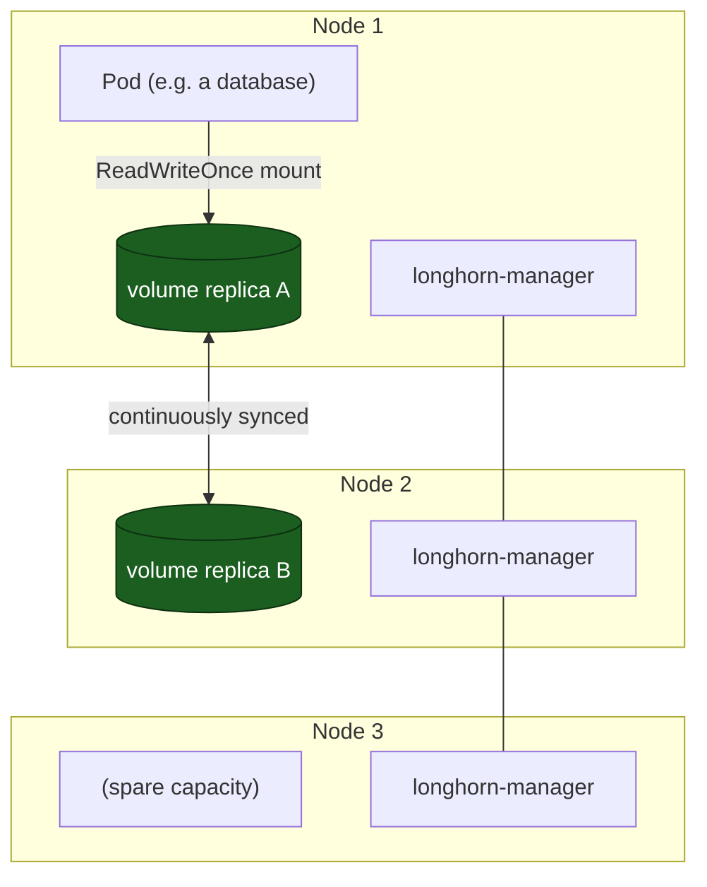

# Distributed storage with Longhorn

So far our cluster can run workloads, route traffic, and hand out TLS certificates
(see [the previous episode](/ingress--free-tls-traefik--cert-manager/)). But there's a
hole we've been quietly ignoring: **where does the data live?**

A container's filesystem is thrown away the moment the Pod is rescheduled. If you run a
database, a note-taking app, or anything stateful and the node it's on reboots, the data
goes with it — unless you give that workload real, durable storage.

This episode fixes that. We'll install **Longhorn**, a distributed block-storage system
that runs *inside* the cluster and replicates each volume across your nodes, so a single
machine dying doesn't lose your data.

<!-- more -->

## What problem are we solving?

Without replicated storage, a Pod's data sits on one node's local disk. That's a single
point of failure:

- Node crashes or gets rebooted → the disk is gone with it.
- The scheduler moves the Pod to another node → it can't see the old disk at all.
- You scale the app to 3 replicas → each one sees *different* data, because they're on
  different disks.

What you actually want is a **StorageClass** that behaves like a network disk: a Pod
anywhere in the cluster can mount it, and the bytes are copied to more than one machine so
no single failure loses them.

Longhorn gives you exactly that, and it's designed for exactly our situation — small
clusters of ordinary Linux boxes, no SAN or cloud volume API required.

## The 10-second mental model



You ask Kubernetes for a `2Gi` volume. Longhorn carves it into **2 replicas** (here, on
Node 1 and Node 2), keeps them in sync, and presents one normal block device to your Pod.
Lose Node 1 and the replica on Node 2 is still there — the Pod gets rescheduled onto Node 3
and mounts the surviving replica. No restore-from-backup dance required for a plain node
failure.

!!! info "Replica count vs node count"
    With **3 nodes** (our setup), a replica count of **2** means any *one* node can fail and
    every volume still has a healthy copy. If you're on **2 nodes**, you can only safely use
    **1 replica** — which means *no* redundancy, so a node loss still loses data. Plan for 3
    nodes before you rely on this for anything you care about.

## Step 0 — host prerequisite (the #1 gotcha)

Longhorn talks to disks through **iSCSI**. Every node must have the `open-iscsi` tools
installed and the `iscsid` service running, or Longhorn's engines can't attach volumes and
you'll stare at `ContainerStatusUnknown` / `Volume detached` forever.

Run this on **each** of your three nodes (Debian/Ubuntu):

```text
sudo apt-get update
sudo apt-get install -y open-iscsi
sudo systemctl enable --now iscsid
# Longhorn calls this binary directly — confirm it exists:
ls -l /usr/sbin/iscsiadm
```

If `iscsiadm` is missing on a node, fix it there *before* installing Longhorn. This is the
single most common "why are my volumes stuck?" cause.

## Step 1 — install Longhorn (GitOps way)

We've been running everything through Flux since [episode 4](/gitops-with-flux-let-git-run-your-cluster/),
so we'll install Longhorn the same way: as a Helm chart delivered by a `HelmRelease`. In
*your own* Flux repo, create these three files under a `storage/longhorn/` folder.

**`namespace.yaml`** — give it its own namespace:

```yaml
apiVersion: v1
kind: Namespace
metadata:
  name: longhorn-system
```

**`helmrepository.yaml`** — point Flux at the official Longhorn chart repo:

```yaml
apiVersion: source.toolkit.fluxcd.io/v1
kind: HelmRepository
metadata:
  name: longhorn
  namespace: longhorn-system
spec:
  interval: 24h
  url: https://charts.longhorn.io
```

**`helmrelease.yaml`** — this is the actual install. Note the two `2`s: we keep **2
replicas** of every volume and set the **reclaim policy to `Retain`** so deleting a PVC
doesn't instantly wipe the underlying disk (handy when you're learning and misclick):

```yaml
apiVersion: helm.toolkit.fluxcd.io/v2
kind: HelmRelease
metadata:
  name: longhorn
  namespace: longhorn-system
spec:
  interval: 30m
  chart:
    spec:
      chart: longhorn
      version: "1.7.2"
      sourceRef:
        kind: HelmRepository
        name: longhorn
        namespace: longhorn-system
      interval: 24h
  install:
    crds: CreateReplace
  upgrade:
    crds: CreateReplace
  values:
    defaultSettings:
      defaultReplicaCount: 2
    persistence:
      defaultClassReplicaCount: 2
      reclaimPolicy: Retain
    ingress:
      enabled: false
```

Then reference them from a `kustomization.yaml` in that folder:

```yaml
apiVersion: kustomize.config.k8s.io/v1beta1
kind: Kustomization
resources:
  - namespace.yaml
  - helmrepository.yaml
  - helmrelease.yaml
```

Commit, push, and let Flux reconcile (or force it with `flux reconcile source git
flux-system`). Flux pulls chart `1.7.2` and creates all the Longhorn components.

!!! tip "Prefer a version pin you can see"
    We pin `version: "1.7.2"` so an unexpected upstream release can't silently change your
    storage layer. Bump it deliberately when you're ready — Renovate (a later episode) will
    even open a PR for you.

## Step 1b — or install it directly (no Flux yet)

If you haven't wired up Flux, or just want to try Longhorn before committing it to git, the
same chart installs with plain Helm:

```text
helm repo add longhorn https://charts.longhorn.io
helm repo update
kubectl create namespace longhorn-system
helm install longhorn longhorn/longhorn \
  --namespace longhorn-system \
  --set defaultSettings.defaultReplicaCount=2 \
  --set persistence.defaultClassReplicaCount=2 \
  --set persistence.reclaimPolicy=Retain \
  --version 1.7.2
```

Either route lands you in the same place. Pick the GitOps path if you're following the
series; keep the Helm path in your back pocket for a quick test cluster.

## Step 2 — verify it's actually up

Give it a minute, then check the pods and the StorageClass:

```text
kubectl get pods -n longhorn-system
# longhorn-manager-*, longhorn-csi-* , longhorn-ui, longhorn-frontend all Running

kubectl get storageclass
# NAME       PROVISIONER          RECLAIMPOLICY
# longhorn   driver.longhorn.io   Delete        <- the new class
```

Longhorn registers a StorageClass called `longhorn` automatically. Make it the **default**
so plain `PersistentVolumeClaim`s use it without specifying `storageClassName`:

```text
kubectl patch storageclass longhorn \
  -p '{"metadata":{"annotations":{"storageclass.kubernetes.io/is-default-class":"true"}}}'
```

(If you'd rather keep `local-path` as default and opt in per-PVC, skip this and set
`storageClassName: longhorn` in your claims — that's what we'll do below so the intent is
explicit.)

## Step 3 — a real PVC, and proof it replicates

Theory is cheap. Let's create a volume, write data, kill the Pod, and bring it back — and
confirm the bytes survive.

**`pvc.yaml`** — a 2Gi claim on the Longhorn class:

```yaml
apiVersion: v1
kind: PersistentVolumeClaim
metadata:
  name: demo-data
  namespace: default
spec:
  accessModes: [ReadWriteOnce]
  storageClassName: longhorn
  resources:
    requests:
      storage: 2Gi
```

Apply the PVC, then create a small writer Pod that mounts it (via a `persistentVolumeClaim`
volume) and writes a file:

**`writer-pod.yaml`**:

```yaml
apiVersion: v1
kind: Pod
metadata:
  name: writer
  namespace: default
spec:
  restartPolicy: Never
  containers:
    - name: writer
      image: busybox
      command: ["/bin/sh", "-c", "echo 'survived the reboot' > /data/note.txt; cat /data/note.txt"]
      volumeMounts:
        - name: data
          mountPath: /data
  volumes:
    - name: data
      persistentVolumeClaim:
        claimName: demo-data
```

```text
kubectl apply -f pvc.yaml
kubectl apply -f writer-pod.yaml
kubectl logs writer          # -> survived the reboot
kubectl delete pod writer
```

Now look at what Longhorn built. Each volume is split into *replicas* spread across nodes:

```text
kubectl -n longhorn-system get volumes
kubectl -n longhorn-system get replicas
# you'll see 2 replicas for demo-data, on two different nodes
```

The PVC outlived the Pod. Recreate a reader Pod against the same claim and the file is still
there:

**`reader-pod.yaml`**:

```yaml
apiVersion: v1
kind: Pod
metadata:
  name: reader
  namespace: default
spec:
  restartPolicy: Never
  containers:
    - name: reader
      image: busybox
      command: ["/bin/sh", "-c", "cat /data/note.txt"]
      volumeMounts:
        - name: data
          mountPath: /data
  volumes:
    - name: data
      persistentVolumeClaim:
        claimName: demo-data
```

```text
kubectl apply -f reader-pod.yaml
kubectl logs reader      # -> survived the reboot
kubectl delete pod reader
```

That's the whole point: the data outlived the Pod. Drain the node holding replica A and
Longhorn keeps serving from replica B. **That** is what "distributed storage" bought you.

!!! warning "ReadWriteOnce means one node at a time"
    A Longhorn volume mounts `ReadWriteOnce` — one Pod, one node, read-write. Two Pods on two
    nodes can't share it (use `ReadWriteMany` only if your workload truly needs concurrent
    multi-writer access, and understand the performance trade-off). Most databases and apps
    are fine with RWO because only one replica is active anyway.

## Step 4 — daily snapshots (cheap insurance)

Longhorn can snapshot a volume on a schedule. A **snapshot** is a point-in-time copy kept
*inside* the cluster (not off-site backup, just fast rollback). Here's a daily one that keeps
a week:

```yaml
apiVersion: longhorn.io/v1beta2
kind: RecurringJob
metadata:
  name: snapshot-daily
  namespace: longhorn-system
spec:
  name: snapshot-daily
  cron: "0 2 * * *"   # 02:00 every day
  task: snapshot
  retain: 7
  concurrency: 1
  labels:
    category: critical-data
    type: snapshot
```

Apply it and Longhorn snapshots every volume in that namespace each night. Roll back from
the Longhorn UI (next step) or `kubectl` if you ever need to.

!!! info "Going further: real off-site backups"
    Snapshots live on your cluster's own disks — they won't save you from a house fire or a
    wiped Longhorn volume. For genuine disaster recovery, Longhorn's `Backup` RecurringJob
    ships volume data to **S3** (or any S3-compatible bucket). That's a separate episode's
    worth of setup; for now, snapshots are the 80% case and cost you nothing.

## Step 5 — open the Longhorn UI (optional)

The UI is genuinely useful for watching replicas, taking manual snapshots, and expanding
volumes. Expose it through Traefik (from [episode 5](/ingress--free-tls-traefik--cert-manager/))
behind basic auth — never on the open internet without a password:

```yaml
apiVersion: traefik.io/v1alpha1
kind: IngressRoute
metadata:
  name: longhorn
  namespace: longhorn-system
spec:
  entryPoints: [websecure]
  routes:
    - match: Host(`longhorn.example.com`)
      kind: Rule
      middlewares:
        - name: longhorn-basic-auth
          namespace: longhorn-system
      services:
        - name: longhorn-frontend
          port: 80
  tls:
    secretName: example-com-wildcard-tls   # your cert-manager wildcard cert
```

The `longhorn-basic-auth` middleware reads a `BasicAuth` Secret you create yourself (a
hashed `user:password` via `htpasswd`). Don't skip the auth — the UI can delete volumes.

## What we built vs. what's "production"

Honest scorecard for this episode:

- ✅ Replicated block storage across 3 nodes — a node loss no longer loses data.
- ✅ GitOps-installed, version-pinned, default StorageClass ready.
- ✅ Daily snapshots for fast rollback.
- ⚠️ Snapshots are *not* off-site backups — add S3 backup jobs before you trust it with
  anything irreplaceable.
- ⚠️ Single control-plane (from episode 2) is still the cluster's weak point; storage being
  replicated doesn't make the API server redundant.

That last point is the theme of the series' final episode. For now: you have durable,
replicated storage, which is most of what "production-ish" means for a homelab.

## What's next

Next up: [episode 7: secrets without plaintext — SOPS + age](/secrets-without-plaintext-sops--age/). Right now any password we put
in a manifest is visible to anyone with the git repo. We'll fix that by encrypting secrets
*in* git with age, so the cluster can read them but the world can't.

*This is episode 6 of the **Homelab From Scratch (Hands-On Build)** series — a step-by-step
build of a real k3s homelab. Catch up from
[episode 1: hardware + OS baseline](/before-you-start-hardware--os-baseline/) if you're
jumping in here.*
