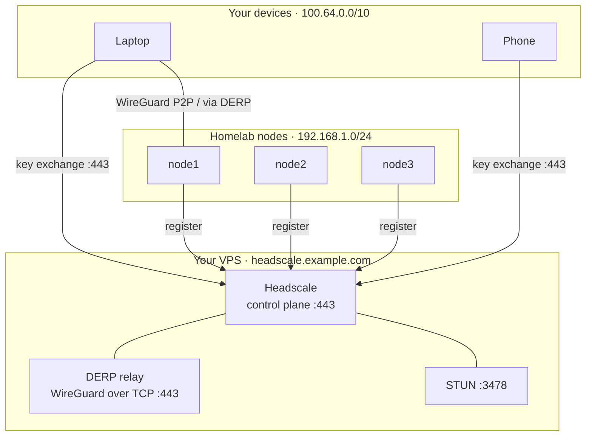

# Remote access: Headscale (self-hosted Tailscale)

By now you have a real cluster: nodes talking over Cilium, apps behind Traefik, secrets in
Git. But the whole thing lives on your LAN. The moment you leave the house, you can't reach it —
and you certainly can't reach it safely from a phone on mobile data.

In the [last episode](/secrets-without-plaintext-sops--age/) we locked secrets in Git. This
episode gives you a *private network* that follows you everywhere: a self-hosted Tailscale
control plane called **Headscale**.

<!-- more -->

## What Headscale is (and why not just Tailscale?)

[Tailscale](https://tailscale.com) is a fantastic mesh VPN built on WireGuard. Every device gets
a stable `100.64.x.x` IP, they find each other and talk directly, and you manage who can reach
what with ACLs. The catch: the *control plane* — the server that hands out keys, keeps the node
list, and enforces policy — is run by Tailscale Inc. The free tier is generous but capped, and
your device graph lives on their servers.

**Headscale** is an open-source, API-compatible reimplementation of that control plane. You run
it; the official `tailscale` app on your laptop, phone, and servers just points at *your* server
instead of `login.tailscale.com`. You get:

- no device limit and no paid tier,
- your network topology stays on *your* hardware,
- full ownership of the ACL policy file (committed to Git, like everything else we've built).

!!! tip "Mental model"
    Tailscale the *app* is the client. Headscale is the *server* it checks in with. Swap the
    server, keep the client.

## The shape of it



Two planes, don't confuse them:

- **Control plane** (your VPS, port 443): devices introduce themselves, get keys, and learn the
  current node/ACL map. Tiny bandwidth.
- **Data plane** (peer to peer, WireGuard UDP 41641): once two devices have shaken hands they
  talk *directly*. Your VPS is not in the path.

When a nasty NAT blocks a direct connection, traffic falls back to the **DERP** relay (also on
your VPS, WireGuard-over-TCP on 443). That's why we enable the embedded DERP server below — it
saves you when a phone or hotel Wi-Fi won't allow P2P.

## What you'll need

- A VPS with a **public IPv4** address. An Oracle Cloud "Always Free" `VM.Standard.E2.1.Micro`
  (Ubuntu 24.04) is enough; Hetzner/Akamai/Lightsail work too.
- A domain you control. We'll use `example.com` throughout — substitute yours.
- These ports open **to the world** on the VPS:

| Protocol | Port   | Purpose                                  |
| -------- | ------ | ---------------------------------------- |
| TCP      | 22     | SSH (you already use this)               |
| TCP      | 80     | Let's Encrypt HTTP-01 challenge          |
| TCP      | 443    | Headscale HTTPS + TS2021 + DERP relay    |
| UDP      | 41641  | WireGuard direct connections             |
| UDP      | 3478   | STUN (NAT traversal)                     |

!!! warning "Cloudflare proxy will silently break this"
    Headscale speaks the **TS2021** protocol — a WebSocket upgrade over HTTPS. Cloudflare's
    proxy strips the `Upgrade: websocket` header (even with WebSockets "enabled"), so the
    connection fails with no obvious error. Point your DNS **directly** at the VPS IP (grey
    cloud / "DNS only" if you use Cloudflare). A plain public IP is required here.

## Step 1 — Point DNS at your VPS

Create an **A record**:

```
headscale.example.com  ->  YOUR_VPS_PUBLIC_IP
```

Make it unproxied. Give DNS a minute to propagate; verify with:

```text
dig +short headscale.example.com
# -> YOUR_VPS_PUBLIC_IP
```

## Step 2 — Open the firewall

On the VPS itself (assuming `ufw`):

```bash
sudo ufw allow 22,80,443/tcp
sudo ufw allow 41641/udp
sudo ufw allow 3478/udp
sudo ufw enable
```

If your provider has a separate security list (Oracle does), open the same five ports there too —
`ufw` alone won't help if the cloud firewall drops the packet first.

## Step 3 — Install Headscale

Headscale ships a single static binary. The cleanest install is the official `.deb`:

```bash
# pick the arch that matches your VPS (amd64 shown; use _arm64 for aarch64)
curl -fsSL -o /tmp/headscale.deb \
  https://github.com/juanfont/headscale/releases/download/v0.29.3/headscale_0.29.3_linux_amd64.deb
sudo dpkg -i /tmp/headscale.deb
```

The package drops a `systemd` unit and a default config dir. Now write your real config. This is
the heart of the setup — it turns on TLS (via Let's Encrypt), the embedded DERP relay, MagicDNS,
and points at your ACL file:

```yaml
# /etc/headscale/config.yaml
server_url: https://headscale.example.com
listen_addr: 0.0.0.0:443
metrics_listen_addr: 127.0.0.1:9090

noise:
  private_key_path: /var/lib/headscale/noise_private.key

prefixes:
  v4: 100.64.0.0/10
  v6: fd7a:115c:a1e0::/48
  allocation: sequential

derp:
  server:
    enabled: true
    region_id: 999
    region_code: "homelab"
    region_name: "Homelab DERP"
    verify_clients: true
    stun_listen_addr: "0.0.0.0:3478"
    private_key_path: /var/lib/headscale/derp_server_private.key
    automatically_add_embedded_derp_region: true
    ipv4: YOUR_VPS_PUBLIC_IP
  urls:
    - https://controlplane.tailscale.com/derpmap/default
  auto_update_enabled: true
  update_frequency: 3h

database:
  type: sqlite
  sqlite:
    path: /var/lib/headscale/db.sqlite

# Automatic Let's Encrypt cert (HTTP-01). Headscale listens on :80 just for the challenge.
acme_url: https://acme-v02.api.letsencrypt.org/directory
acme_email: "you@example.com"
tls_letsencrypt_hostname: "headscale.example.com"
tls_letsencrypt_cache_dir: /var/lib/headscale/cache
tls_letsencrypt_challenge_type: HTTP-01
tls_letsencrypt_listen: ":80"

dns:
  magic_dns: true
  base_domain: hs.example.com
  override_local_dns: true
  nameservers:
    global:
      - 1.1.1.1
      - 1.0.0.1

policy:
  mode: file
  path: /etc/headscale/acl.json

log:
  level: info
  format: text

unix_socket: /var/run/headscale/headscale.sock
```

!!! info "Two domain names on purpose"
    `server_url` is `headscale.example.com` (where clients connect). `base_domain` under `dns:`
    is `hs.example.com` — the suffix MagicDNS gives your machines (e.g. `node1.hs.example.com`).
    They **must differ**, or MagicDNS resolves the wrong thing. Pick any subdomain you own.

Start it and confirm it's healthy (the first start fetches the TLS cert, so give it a few seconds):

```bash
sudo systemctl enable --now headscale
sleep 5
sudo headscale version
curl -fsS https://headscale.example.com/health      # -> {"status":"pass"}
```

## Step 4 — Create a user and your ACL policy

Headscale organizes devices under **users** (think: namespaces). Create one:

```bash
sudo headscale users create myuser
```

Now write the ACL policy. Headscale uses *HuJSON* (JSON with comments and trailing commas), so
keep the comments — they make the policy readable:

```json
// /etc/headscale/acl.json
{
  "groups": {
    "group:admin": ["you@example.com"]
  },
  "tagOwners": {
    "tag:homelab": ["group:admin"]
  },
  "acls": [
    {
      "action": "accept",
      "src": ["*"],
      "dst": ["*:*"]
    }
  ],
  "ssh": [
    {
      "action": "accept",
      "src": ["group:admin"],
      "dst": ["autogroup:member", "autogroup:tagged"],
      "users": ["root", "autogroup:nonroot"]
    }
  ],
  "autoApprovers": {
    "routes": {
      "192.168.1.0/24": ["tag:homelab"]
    }
  }
}
```

What each block buys you:

- `acls` — who may reach what. `*` → `*:*` is "everything can talk to everything." Tighten it
  later; start open so the mesh actually works while you learn.
- `tagOwners` + `ssh` — only `group:admin` may tag devices `tag:homelab`, and may SSH to any
  node (uses Tailscale's built-in SSH, no port 22 exposed).
- `autoApprovers.routes` — **the key trick for a homelab**: any device tagged `tag:homelab` that
  advertises the `192.168.1.0/24` route gets it approved *automatically*. No manual step every
  time a node reconnects.

Headscale reloads the policy file on the fly, but restart to be safe:

```bash
sudo systemctl restart headscale
```

## Step 5 — Join your laptop and phone

Generate a **pre-auth key** so devices can register without you copying a URL by hand:

```bash
sudo headscale preauthkeys create --user myuser --reusable --expiration 2h
# preauthkey:
#   hskey:abc123...
```

On your laptop (Linux/macOS/Windows — install the Tailscale app first):

```bash
tailscale up \
  --login-server=https://headscale.example.com \
  --authkey hskey:abc123... \
  --accept-routes
```

`--accept-routes` means "also route traffic for subnets other nodes advertise" — you'll want that
so your laptop can reach the LAN through a node.

On a phone: install Tailscale, tap profile → **Log in** → **Use a different server**, enter
`https://headscale.example.com`, and paste the same pre-auth key when prompted. If the app shows
a login *URL* instead of a key field, open that URL on a machine with `headscale` access and run
`sudo headscale nodes register --user myuser --key <key>` to finish the join.

## Step 6 — Join the homelab nodes (and expose your LAN)

On each of your three nodes, install the client and bring it up *tagged* as homelab, advertising
the LAN route:

```bash
curl -fsSL https://tailscale.com/install.sh | sh
sudo tailscale up \
  --login-server=https://headscale.example.com \
  --authkey hskey:abc123... \
  --accept-routes \
  --advertise-routes=192.168.1.0/24 \
  --advertise-tags=tag:homelab \
  --hostname node1
```

Repeat with `--hostname node2` / `node3`. Because of the `autoApprovers` rule in Step 4, the
`192.168.1.0/24` route is approved the instant each node appears — you do **not** need to run
`headscale nodes approve-routes` by hand.

!!! info "Going further"
    HomeOps wraps the per-node join in an Ansible playbook so `make tailscale` registers all
    three nodes at once. You don't need that — the three `tailscale up` commands above are the
    whole mechanism, pasted straight into each node's shell.

The payoff: from your laptop on a café Wi-Fi, `ping 192.168.1.10` (a node, or any LAN device)
just works, tunneled through the tailnet.

## Step 7 — Verify the mesh

On the VPS:

```bash
sudo headscale nodes list
# ID  Hostname  User    Tags            IPs
# 1   laptop    myuser  -               100.64.0.2
# 2   node1     myuser  [tag:homelab]   100.64.0.3
# ...
```

On any client:

```bash
tailscale status
ping node1.hs.example.com     # MagicDNS name from base_domain
```

If a node shows but `ping` fails, check the two usual suspects: the `192.168.1.0/24` route is
approved (`headscale nodes list` shows it), and every device used `--accept-routes`.

## Going further — a web UI (Headplane)

The CLI is all you need, but [Headplane](https://headplane.dev) gives you a browser UI to manage
users, nodes, and keys. Run it anywhere that can reach `https://headscale.example.com`, give it
an API key (`sudo headscale apikeys create --expiration 8760h`), and point its config at your
server:

```yaml
# headplane config (runs in your cluster or on the VPS)
server:
  host: "0.0.0.0"
  port: 3000
  cookie_secret_path: "/secrets/cookie-secret"
headscale:
  url: "https://headscale.example.com"
  api_key_path: "/secrets/api-key"
```

In the HomeOps stack Headplane runs *in the cluster* behind Traefik, talking to the VPS over the
public URL — a nice example of the cluster and the VPS cooperating. Treat it as optional polish.

## Common mistakes

- **Orange-cloud DNS.** If you use Cloudflare, the proxy strips the TS2021 WebSocket upgrade and
  clients hang at "connecting." Set the record to DNS-only (grey).
- **Forgot `--accept-routes`.** You'll join the mesh but won't be able to reach other nodes'
  advertised subnets (like your LAN).
- **UDP ports closed.** With 41641/3478 blocked, connections can't go P2P and fall back to DERP
  (slower) or fail entirely behind strict NAT.
- **`base_domain` == `server_url` domain.** MagicDNS breaks. Keep them separate subdomains.
- **`ephemeral` nodes.** By default a machine that goes offline long enough is forgotten. For
  homelab nodes you usually want them *persistent* — they are, unless you pass `--ephemeral`.

## Lessons learned

- Your VPS does almost no work: it only brokers the first handshake. Real traffic is WireGuard
  peer-to-peer, so bandwidth and latency stay between the two devices.
- The embedded DERP relay is the unsung hero — it's what keeps things working from restrictive
  networks where P2P is impossible.
- ACLs-as-code feels odd until your third device, then you'll wonder why you ever did port
  forwards by hand.

---

*Part of the [Homelab From Scratch (Hands-On Build)](/) series — previous:
[Secrets without plaintext: SOPS + age](/secrets-without-plaintext-sops--age/). Next up:
[episode 9: monitoring that pages you (Prometheus + Grafana + ntfy)].*
