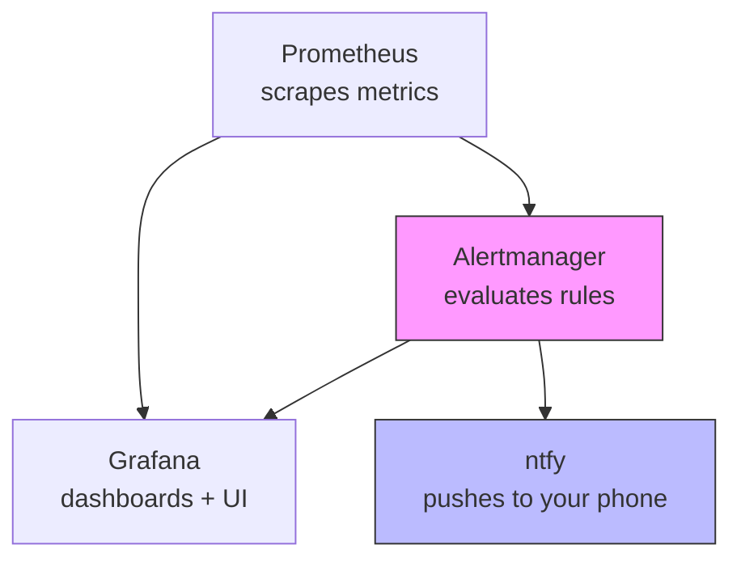

# Monitoring that pages you: Prometheus + Grafana + ntfy

In the last episode, [episode 8: remote access, Headscale (self-hosted Tailscale)](https://blog.shublab.com/remote-access-headscale-self-hosted-tailscale/), we gave ourselves a way into the cluster from anywhere. Now let's make the cluster tell *us* when something is wrong.

A homelab without monitoring is a homelab that finds out about problems from a user complaining — or from a service that has been down for three days. This episode adds the core observability stack: Prometheus for metrics, Grafana for dashboards, and ntfy so an alert actually pages your phone instead of sitting in a log file nobody reads.

<!-- more -->

## What we're building

Three components, installed as one Helm release into a `monitoring` namespace:



- **kube-prometheus-stack** — a single Helm chart that brings Prometheus, Alertmanager, Grafana, node exporter, kube-state-metrics, and the Prometheus Operator CRDs together. One HelmRelease, one namespace.
- **Alertmanager** — the part that decides *what* is worth paging. Prometheus fires an alert; Alertmanager dampens, groups, and routes it somewhere.
- **ntfy** — a lightweight pub/sub notification service. Alertmanager sends a POST to ntfy's HTTP API, and ntfy pushes the message to anything subscribed (phone app, web UI, email, Discord, etc.).

## Before you begin

You should have a working k3s cluster with Cilium, Flux, and an accessible `monitoring` namespace. If you're following along from the start, you need at least:

- k3s installed across your nodes ([episode 2: install k3s across 3 nodes](https://blog.shublab.com/install-k3s-across-3-nodes/))
- Cilium as the CNI ([episode 3: networking with Cilium + a load-balancer VIP](https://blog.shublab.com/networking-with-cilium--a-load-balancer-vip/))
- Flux bootstrapping your cluster from git ([episode 4: GitOps with Flux](https://blog.shublab.com/gitops-with-flux-let-git-run-your-cluster/))

You also need `kubectl` pointed at your cluster and `helm` available. The snippets below use raw `kubectl` and `helm` — if you're following along with the real HomeOps repo, note that HomeOps wraps these behind a Makefile, but the commands here are what actually run.

## Step 1 — Confirm the monitoring namespace exists

The rest of this episode assumes a `monitoring` namespace. If you haven't created it yet:

```bash
kubectl create namespace monitoring
```

In a Flux-managed cluster you'd usually declare the namespace in git (a `namespace.yaml` in your `monitoring/` Kustomization), but for a one-off manual setup `kubectl create namespace` is fine.

## Step 2 — Add the Prometheus community Helm repo

```bash
helm repo add prometheus-community https://prometheus-community.github.io/helm-charts
helm repo update
```

## Step 3 — Install kube-prometheus-stack

This is the big one. The chart bundles Prometheus, Alertmanager, Grafana, node exporter, kube-state-metrics, and the Prometheus Operator. We install it once and let it manage the whole stack.

For anything beyond the defaults, a values file is much easier to read and edit than a wall of `--set` flags. Save this as `monitoring-values.yaml`:

```yaml
# monitoring-values.yaml
alertmanager:
  alertmanagerSpec:
    replicas: 1
    storage:
      volumeClaimTemplate:
        metadata:
          labels:
            recurring-job.longhorn.io/source: "enabled"
            recurring-job.longhorn.io/snapshot-daily: "enabled"
        spec:
          storageClassName: longhorn
          accessModes: ["ReadWriteOnce"]
          resources:
            requests:
              storage: 10Gi

prometheus:
  prometheusSpec:
    replicas: 1
    retention: 14d
    retentionSize: 90Gi
    storageSpec:
      volumeClaimTemplate:
        metadata:
          labels:
            recurring-job.longhorn.io/source: "enabled"
        spec:
          storageClassName: longhorn
          accessModes: ["ReadWriteOnce"]
          resources:
            requests:
              storage: 100Gi

grafana:
  enabled: true
  adminUser: admin
  ingress:
    enabled: false

nodeExporter:
  enabled: true

kubeStateMetrics:
  enabled: true

defaultRules:
  create: true
```

Then install:

```bash
helm upgrade --install kube-prometheus-stack prometheus-community/kube-prometheus-stack \
  --namespace monitoring \
  --create-namespace \
  -f monitoring-values.yaml
```

A few things worth calling out:

- **Storage is Longhorn.** Both Prometheus and Alertmanager get a `volumeClaimTemplate` backed by the `longhorn` storage class, so their on-disk metrics survive pod restarts and get replicated across nodes. If you don't have Longhorn yet, see [episode 6: distributed storage with Longhorn](https://blog.shublab.com/distributed-storage-with-longhorn/).
- **Retention.** 14 days of metrics with a 90 GB size cap keeps Prometheus from eating your disk. Adjust to your cluster size and disk capacity.
- **Grafana ingress is disabled.** We don't expose Grafana publicly in this setup — it's reachable over the cluster network (and, in a real homelab, over your Tailscale / Headscale tailnet). Exposing Grafana with a public TLS ingress is a separate decision with its own auth story; we're leaving that for another day.

Wait for the pods to come up:

```bash
kubectl get pods -n monitoring -w
```

You should see `kube-prometheus-stack-operator-*`, `prometheus-kube-prometheus-stack-0`, `alertmanager-kube-prometheus-stack-alertmanager-0`, `grafana-*`, and several node-exporter / kube-state-metrics pods all become `Running`.

## Step 4 — Log into Grafana

Port-forward Grafana locally to grab the admin password and log in:

```bash
kubectl port-forward -n monitoring svc/kube-prometheus-stack-grafana 3000:80
```

The admin username is `admin`. The password is whatever you set in the Helm values (or, if you didn't set one explicitly, the chart generates a random one and stores it in a Secret called `grafana-admin-secret` in the `monitoring` namespace — this is the chart's default Secret name for the admin password). Retrieve the generated password with:

```bash
kubectl get secret -n monitoring grafana-admin-secret -o jsonpath='{.data.admin-password}' | base64 -d
```

Open `http://localhost:3000` in your browser, log in, and change the password when prompted. Grafana's built-in dashboards (from the `defaultRules.create=true` flag) will already be populated with Prometheus data — check the "Prometheus / Kubernetes / Compute Resources" dashboards to see your nodes and pods showing live metrics.

## Step 5 — Understand what you're seeing

Before we add alerts, it helps to know what the stack is already doing for free.

- **Prometheus** scrapes metrics from every node (via node exporter), every pod that exposes a `/metrics` endpoint, and the Kubernetes control plane (via kube-state-metrics). The `kube-prometheus-stack` default rules already define a set of sensible alerts — things like "Pods are failing," "Node is down," "Insufficient memory," and "Cluster is in hybrid mode" — which you can see in Alertmanager under the "Pending" / "Active" tabs.
- **Alertmanager** receives those alerts, groups them, and routes them somewhere. Right now it has no receiver configured, so alerts are visible in the Grafana Alertmanager UI but nobody gets paged. That's the next step.
- **Grafana** is the visualization layer. The default dashboards are useful, but the real win comes when you build a dashboard that answers "is my homelab healthy?" in a single glance.

## Step 6 — Wire Alertmanager to ntfy

This is where monitoring stops being a dashboard nobody looks at and starts being a page that actually gets your attention.

### Why ntfy

ntfy is a simple pub/sub notification service. You POST a message to a topic, and anyone subscribed to that topic (phone app, web UI, webhook, email, Discord, etc.) receives it. For a homelab it's a good fit because:

- It's lightweight — a single deployment, no heavy dependencies.
- It has a free public tier (`ntfy.sh`) if you don't want to self-host, plus a self-hosted option if you do.
- Alertmanager can talk to it over plain HTTP with a bearer token.

> !!! info "ntfy is already part of our setup"
> In our cluster, ntfy is deployed as its own app (separate from the monitoring stack) and reachable over the tailnet. This episode wires Alertmanager to it; if you haven't deployed ntfy yet, see the ntfy deployment docs for your setup, or use the public `ntfy.sh` tier for testing. The Alertmanager config below works with either.

### Create an Alertmanager config that routes to ntfy

The Prometheus Operator manages Alertmanager via an `Alertmanager` CRD — a custom Kubernetes resource. The config that Alertmanager uses lives in a Kubernetes Secret. We'll create one that sends a message to an ntfy topic when an alert fires.

Save this as `alertmanager-config.yaml`:

```yaml
apiVersion: v1
kind: Secret
metadata:
  name: alertmanager-config
  namespace: monitoring
type: Opaque
stringData:
  alertmanager.yaml: |
    route:
      group_by: ['alertname', 'cluster']
      group_wait: 30s
      group_interval: 5m
      repeat_interval: 4h
      receiver: 'ntfy'
      routes:
        - match:
            severity: critical
          receiver: 'ntfy-critical'
    receivers:
      - name: 'ntfy'
        ntfy:
          url: 'https://ntfy.sh'
          topic: 'homelab-alerts'
          headers:
            Authorization: 'Bearer YOUR_NTFY_TOKEN'
      - name: 'ntfy-critical'
        ntfy:
          url: 'https://ntfy.sh'
          topic: 'homelab-alerts-critical'
          headers:
            Authorization: 'Bearer YOUR_NTFY_TOKEN'
```

Replace `YOUR_NTFY_TOKEN` with an ntfy auth token if you're using a protected topic, and adjust the `url` / `topic` values to match your ntfy setup (self-hosted endpoint and topic name). If you're using the public `ntfy.sh` with a public topic, you can omit the `Authorization` header — but a public topic means anyone who guesses the topic name can read your alerts, so a token-protected topic is the better default.

> !!! warning "Public ntfy topics are readable by anyone"
> If you use a public `ntfy.sh` topic without a token, anyone who knows the topic name can subscribe and read every alert you send — including alert names that may hint at your infrastructure. Use a token-protected topic or self-host ntfy if you want the alerts to stay between you and your cluster.

Apply the config Secret:

```bash
kubectl apply -f alertmanager-config.yaml
```

Now tell the Alertmanager CRD to use our config Secret instead of the default. The `kube-prometheus-stack` chart creates an `Alertmanager` resource named `kube-prometheus-stack-alertmanager` in the `monitoring` namespace. Rather than patching it with inline JSON, the cleaner approach is to add the config reference directly to your Helm values file and re-run the upgrade — that way the wiring is declarative and survives chart upgrades:

```yaml
# Add to monitoring-values.yaml
alertmanager:
  alertmanagerSpec:
    useExistingSecret: true
    configSecret: alertmanager-config
```

Then:

```bash
helm upgrade --install kube-prometheus-stack prometheus-community/kube-prometheus-stack \
  --namespace monitoring \
  -f monitoring-values.yaml
```

Wait a moment, then confirm Alertmanager has picked up the new config:

```bash
kubectl logs -n monitoring -l app.kubernetes.io/name=alertmanager -f
```

You should see the Alertmanager pods reload and the new receiver (`ntfy`) listed in their logs.

### Test the pipeline end to end

Fire a test alert to make sure the wiring works. The easiest way is to create a `PrometheusRule` that intentionally fires:

```yaml
apiVersion: monitoring.coreos.com/v1
kind: PrometheusRule
metadata:
  name: test-alert
  namespace: monitoring
spec:
  groups:
    - name: test
      rules:
        - alert: TestAlertFromHomelab
          expr: vector(1)
          for: 1m
          labels:
            severity: critical
          annotations:
            summary: "Test alert — if you see this, the pipeline works"
```

Apply it:

```bash
kubectl apply -f test-prometheus-rule.yaml
```

Within a minute, Prometheus should evaluate the rule, fire the alert, and Alertmanager should route it to ntfy. You should see a message arrive in your ntfy topic (phone app, web UI, or wherever you're subscribed). After you confirm it works, delete the test rule:

```bash
kubectl delete prometheusrule test-alert -n monitoring
```

> !!! tip "Going further — what to alert on"
> `vector(1)` is a test that always fires. Real alerts come from the default rules the chart already ships (pod failures, node down, disk pressure, etc.) plus rules you add for the things *your* homelab cares about — for example, "Longhorn replica is not healthy," "cert-manager certificate is expiring soon," or "the blog is returning 5xx." Start with the defaults, then add one or two rules that matter to you, and watch them in Alertmanager's "Pending" state before they fire.

## Step 7 — Set up a simple Grafana dashboard

Grafana's default dashboards are useful, but a single "homelab health" dashboard is what you'll actually look at. Create one in Grafana's UI:

1. In Grafana, go to **Dashboards → New dashboard → Add visualization**.
2. Select the Prometheus data source.
3. Add a panel for "Cluster node CPU usage" with the query:
   ```
   100 - (avg by (instance) (rate(node_cpu_seconds_total{mode="idle"}[5m])) * 100)
   ```
4. Add a panel for "Node memory usage":
   ```
   (node_memory_MemTotal_bytes - node_memory_MemAvailable_bytes) / node_memory_MemTotal_bytes * 100
   ```
5. Add a panel for "Pod restarts in the last hour":
   ```
   sum by (pod) (rate(kube_pod_container_status_restarts_total[1h])) * 60
   ```
6. Save the dashboard as "Homelab Health."

That's a starting point. The dashboards that matter are the ones that answer your specific questions — "are my nodes healthy?", "is storage OK?", "did an app just crash?" — so build outward from there.

## Step 8 — What about persistent storage for the monitoring stack?

Both Prometheus and Alertmanager store data on Longhorn PersistentVolumeClaims (the `volumeClaimTemplate` blocks in the Helm values). That means:

- Their metrics survive pod restarts and node failure.
- Longhorn replicates the data across nodes, so a single-node loss doesn't lose your metrics history.
- The `snapshot-daily` label on the PVCs (if you have the Longhorn recurring-jobs controller set up) gives you daily snapshots you can roll back if needed.

If you're not using Longhorn, swap the `storageClassName` to whatever storage you do have — but be aware that without replicated storage, a node loss can take your metrics history with it.

## Recap

At this point you have:

- **Prometheus** scraping your cluster's metrics.
- **Grafana** giving you dashboards (including the defaults from the chart).
- **Alertmanager** evaluating alert rules and routing them.
- **ntfy** pushing alerts to your phone (or wherever you subscribe).

The stack doesn't page you yet unless you've wired Alertmanager to a receiver — which is exactly what step 6 does. Once that's in place, a pod failure or a node going down will actually reach you instead of sitting in a log.

## What's next

Monitoring tells you when things go wrong; the next episode is about keeping things from going wrong in the first place — automated patching with Renovate, auto-reload on config changes with Reloader, and a Web Application Firewall with CrowdSec. [episode 10: keeping it patched & safe — Renovate, Reloader, CrowdSec](https://blog.shublab.com/keeping-it-patched--safe-renovate-reloader-crowdsec/) walks through all three.

---

*This is episode 9 of the [Homelab From Scratch (Hands-On Build)](https://blog.shublab.com/start-here-a-hands-on-homelab-from-3-mini-pcs/) series.*
