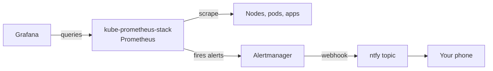

# Monitoring that pages you: Prometheus + Grafana + ntfy

In the [last episode](/remote-access-headscale-self-hosted-tailscale/) you gave the cluster a
private network that follows you everywhere. Nice. But right now your cluster is a **silent**
fire — if a node dies, a pod crashes, or the disk fills up, nothing tells you. You find out when
a service stops working.

That's not "production-grade." Production-grade means the cluster *tells you* the moment
something is wrong — ideally before users do.

This episode stands up the classic monitoring trio on your k3s cluster:

- **Prometheus** — scrapes and stores metrics from your nodes, pods, and apps.
- **Grafana** — turns those metrics into dashboards you can actually read.
- **Alertmanager** — decides when a metric is "bad enough" to page you, and ships that page to
  **ntfy** so it lands on your phone.

By the end you'll have `kubectl top` working, a Grafana dashboard behind TLS, and a real alert
buzzing your phone. Let's go.

<!-- more -->

## What we're building



Everything runs inside the cluster you already built. Grafana gets a TLS ingress reusing the
Traefik + cert-manager setup from [episode 5](/ingress--free-tls-traefik--cert-manager/), and
the alert "pager" is just an ntfy topic you subscribe to.

## Step 1 — `kubectl top` with metrics-server

Prometheus can scrape a lot, but Kubernetes itself needs a way to report CPU/memory usage. That's
`metrics-server`. It's a tiny, quick win, so we do it first.

```bash
helm repo add metrics-server https://kubernetes-sigs.github.io/metrics-server/
helm repo update

kubectl create namespace kube-system 2>/dev/null || true

helm install metrics-server metrics-server/metrics-server \
  -n kube-system \
  --set args[0]=--kubelet-insecure-tls
```

!!! warning "Why `--kubelet-insecure-tls`?"
    On k3s the kubelet serves its metrics endpoint with a self-signed certificate that
    metrics-server doesn't trust by default. This flag tells it to skip that check. It's fine for
    a homelab; for a stricter setup you'd wire up proper kubelet certs (a "going further" topic).

Give it a minute, then:

```bash
kubectl top nodes
kubectl top pods -A
```

If you see numbers instead of `error: metrics not available`, you're golden.

## Step 2 — Prometheus + Grafana + Alertmanager

We'll use the `kube-prometheus-stack` Helm chart. It bundles Prometheus, Grafana, Alertmanager,
plus a bunch of sane default alert rules and dashboards.

```bash
helm repo add prometheus-community https://prometheus-community.github.io/helm-charts
helm repo update

kubectl create namespace monitoring
```

Create the namespace, then a Secret for the Grafana admin password (we'll point Grafana at it so
we don't hard-code the password in a values file):

```bash
kubectl create secret generic grafana-admin-secret -n monitoring \
  --from-literal=admin-user=admin \
  --from-literal=admin-password='ChangeMeStrong123!'
```

!!! tip "Harden this later with SOPS"
    That password is sitting in a plain Kubernetes Secret right now. Episode
    [7](/secrets-without-plaintext-sops--age/) showed you how to encrypt secrets in Git with
    SOPS + age — you can move this into your cluster repo the same way. For now, a plain Secret
    keeps the tutorial moving.

Now write a values file. This is the part you'll actually tune:

```bash
cat > monitoring-values.yaml <<'EOF'
grafana:
  admin:
    existingSecret: grafana-admin-secret
    userKey: admin-user
    passwordKey: admin-password
  ingress:
    enabled: false

prometheus:
  prometheusSpec:
    retention: 14d
    storageSpec:
      volumeClaimTemplate:
        spec:
          storageClassName: longhorn
          accessModes: ["ReadWriteOnce"]
          resources:
            requests:
              storage: 50Gi

alertmanager:
  alertmanagerSpec:
    replicas: 1
  config:
    global:
      resolve_timeout: 5m
    route:
      receiver: ntfy-webhook
      group_by: ['alertname', 'namespace']
      group_wait: 30s
      group_interval: 5m
      repeat_interval: 4h
    receivers:
      - name: ntfy-webhook
        webhook_configs:
          - url: "https://ntfy.sh/<your-topic>"
            send_resolved: true
EOF
```

Install it:

```bash
helm install kube-prometheus-stack prometheus-community/kube-prometheus-stack \
  -n monitoring -f monitoring-values.yaml
```

This pulls a few images and starts a dozen-ish pods. Watch them come up:

```bash
kubectl get pods -n monitoring
kubectl get svc -n monitoring
```

You're looking for `Running` on the `prometheus`, `grafana`, and `alertmanager` pods. If a pod is
`CrashLoopBackOff`, check its logs — usually it's the PVC not binding (did Longhorn finish
[episode 6](/distributed-storage-with-longhorn/)?) or a missing Secret.

!!! info "The GitOps way (what HomeOps actually does)"
    In the real HomeOps repo this isn't a `helm install` — it's two small manifests committed to
    Git and reconciled by Flux: a `HelmRepository` pointing at
    `https://prometheus-community.github.io/helm-charts`, and a `HelmRelease` carrying the same
    values. That's the exact same install, just driven by Git instead of your terminal. If you
    followed the Flux path from episode 4, dropping those two files into your cluster repo gives
    you the identical result and an automatic upgrade every time the chart bumps.

## Step 3 — Open Grafana over TLS

You could `kubectl port-forward` forever, but you already built Traefik + cert-manager, so let's
use them. Create an ingress for Grafana:

```bash
cat > grafana-ingress.yaml <<'EOF'
apiVersion: networking.k8s.io/v1
kind: Ingress
metadata:
  name: grafana
  namespace: monitoring
  annotations:
    cert-manager.io/cluster-issuer: letsencrypt-prod
    traefik.ingress.kubernetes.io/router.middlewares: traefik-security-headers@kubernetescrd
spec:
  ingressClassName: traefik
  tls:
    - hosts:
        - grafana.example.com
      secretName: grafana-tls
  rules:
    - host: grafana.example.com
      http:
        paths:
          - path: /
            pathType: Prefix
            backend:
              service:
                name: kube-prometheus-stack-grafana
                port:
                  number: 80
EOF

kubectl apply -f grafana-ingress.yaml
```

Two things you must have done from earlier episodes:

- Point DNS `grafana.example.com` → your Traefik load-balancer VIP (the LAN IP Cilium handed
  Traefik back in [episode 3](/networking-with-cilium--a-load-balancer-vip/)).
- The `letsencrypt-prod` ClusterIssuer from [episode 5](/ingress--free-tls-traefik--cert-manager/)
  must exist. If you skipped that middleware, just delete the `router.middlewares` annotation
  line.

Open `https://grafana.example.com`, log in as `admin` with your password, and you'll land on a
Grafana pre-loaded with Kubernetes dashboards. 🎉

## Step 4 — Make it actually page you

Monitoring you have to remember to check isn't monitoring — it's a dashboard. The whole point is
the cluster calls *you*.

1. Install the **ntfy** app on your phone (iOS/Android/F-Droid) or just open
   `https://ntfy.sh/<your-topic>` in a browser.
2. Pick a random topic name and replace `<your-topic>` in the values file above with it. (No
   signup, no server to run — `ntfy.sh` is a free public instance. For a private setup you can
   self-host ntfy on the cluster later — see "Going further".)
3. Re-apply the values so Alertmanager picks up the new receiver:

```bash
helm upgrade kube-prometheus-stack prometheus-community/kube-prometheus-stack \
  -n monitoring -f monitoring-values.yaml
```

Now, whenever one of the default alert rules fires (a pod crash-looping, a node down, a PVC out
of space, etc.), Alertmanager POSTs it to your ntfy topic and your phone buzzes.

!!! info "The alert message will be JSON — and that's OK"
    Alertmanager sends its native JSON payload to the webhook. ntfy delivers that JSON as the
    notification body, so the message looks a bit noisy. It's 100% functional and great for a
    first cut. If you want nicely formatted "🚨 Pod crash-looping in namespace X" messages, run a
    tiny `prometheus-webhook-ntfy` bridge between Alertmanager and ntfy that reformats the
    payload — a common, well-documented add-on you can drop in once the basic pipeline works.

## Step 5 — Prove it works (don't wait for a real outage)

You don't have to break something to test the page. Inject a synthetic alert straight into
Alertmanager:

```bash
kubectl exec -n monitoring kube-prometheus-stack-alertmanager-0 -c alertmanager -- \
  amtool alert add alertname=TestAlert severity=critical instance=demo
```

Within ~30 seconds your phone should buzz with the `TestAlert`. Resolve it:

```bash
kubectl exec -n monitoring kube-prometheus-stack-alertmanager-0 -c alertmanager -- \
  amtool alert query
```

If the buzz arrived, the full chain — Prometheus ➜ Alertmanager ➜ ntfy ➜ you — is live.

## Going further

- **Self-host ntfy** on the cluster instead of `ntfy.sh` (it's just another app behind Traefik,
  exactly like the capstone in a later episode). Then your alerts never leave your infrastructure.
- **Encrypt the Grafana password and ntfy topic** with SOPS + age ([episode 7](/secrets-without-plaintext-sops--age/)).
- **Write your own alerts** with a `PrometheusRule` — e.g. "page me if any Ingress has been
  returning 5xx for 5 minutes."
- **Build a status dashboard** in Grafana for the whole house: internet uptime, disk, temperature.

## Recap

You now have a cluster that watches itself and tugs your sleeve when it's unhappy:

- `metrics-server` → `kubectl top` works.
- `kube-prometheus-stack` → Prometheus, Grafana, Alertmanager, default alert rules + dashboards.
- Grafana behind Traefik + TLS, reusing episode 5's ingress pattern.
- Alertmanager → ntfy → your phone, verified with a test alert.

That's the difference between "a cluster" and "a cluster I can trust overnight."

---

**Previous:** [Remote access: Headscale (self-hosted Tailscale)](/remote-access-headscale-self-hosted-tailscale/)
**Next up:** [episode 10: Keeping it patched & safe — Renovate, Reloader, CrowdSec] (coming soon)
