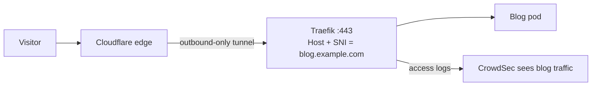

# How My Homelab Blog Got a Public URL Without Opening a Port

Almost everything in my homelab is deliberately *not* on the public internet. The dashboards, the databases, the bots — they're reachable from home or my VPN, and that's it. A blog, though, has to be readable by anyone. So it became the one app I had to expose.

This is the story of *how* I exposed it without forwarding a single port or publishing my home IP — and the embarrassing misconfiguration I shipped for months before noticing it had quietly turned off part of my security tooling.

<!-- more -->

## The default: everything stays on the LAN

As I described in my [architecture overview](/how-my-3-node-k3s-homelab-actually-works/), every app in this cluster gets a subdomain whose DNS points at the cluster's internal load-balancer IP — a private address on my LAN. From outside my network that address is simply unroutable, so the app is unreachable. That's the whole "private" design: not a firewall rule, just an address nobody off my network can route to.

It's a great default. It means I never have to think about hardening each app, because they're not reachable in the first place. The blog broke that pattern on purpose.

## Why the blog had to be different

A blog you can only read from your own house is not much of a blog. It needs to be publicly reachable. There are a few ways to do that, and they trade off differently:

- **Port-forward 443 from the router to Traefik.** Simple, but it puts your home IP in public DNS, fights ISP CGNAT and dynamic IPs, and a single mistake exposes everything sitting behind Traefik.
- **A VPS as a public reverse proxy.** More robust, but more infrastructure, more cost, and another thing to keep patched.
- **A Cloudflare Tunnel.** An agent *inside* my cluster makes an *outbound* connection to Cloudflare. Cloudflare's edge then proxies public visitors back through that tunnel to my app. No open ports, my home IP stays hidden behind Cloudflare's, and I get caching, WAF, and rate-limiting for free.

I went with the tunnel. For a personal blog the tradeoff is excellent: the cost is trusting Cloudflare with that one app's traffic and adding a Cloudflare dependency (if they're down, the blog is down — but so is a lot of the internet).

## The part I got wrong

When I first wired it up, the tunnel pointed *straight at the blog's internal Service* — something like `http://blog.blog.svc.cluster.local:80` — bypassing Traefik entirely. It loaded in a browser, so I shipped it and moved on.

Months later, while adding analytics, I discovered two consequences of that shortcut:

1. **The blog got none of Traefik's centralized security-headers middleware** (HSTS and friends that every other app gets).
2. **My intrusion-prevention tool, CrowdSec, was blind to the blog.** CrowdSec's agent only reads Traefik's access logs. With traffic skipping Traefik, there were no blog logs for it to see — so brute-force and scan detection for the *one public app* was silently off.

And there was a structural tell: because the tunnel talked to the Service directly, there was **no Traefik Ingress object for the blog at all**, unlike every other app in the cluster.

The lesson hit hard: *a request path that loads in a browser is not the same as a request path that is observable and protected.* "It works" had been hiding a real gap for months.

## Fixing it: route through Traefik

The fix is to point the tunnel at Traefik (`https://traefik.traefik.svc.cluster.local:443`) instead of the blog Service, and let Traefik do the host-based routing it already does for everything else — then add a normal Traefik Ingress for the blog. Now the blog gets the same security headers and the same log visibility as every other app.

That sounds like one setting. It is actually three, and each one bit me once:

1. **Service URL must be `https://...:443`, not `:80`.** Traefik only has a route for `blog.example.com` on its TLS entrypoint (port 443), not the plain-HTTP entrypoint. And it must be `https://`, not `http://` on 443 — a plaintext request hitting a TLS-only port fails the handshake outright.
2. **The "HTTP Host Header" must be set explicitly to `blog.example.com`.** Traefik routes purely by the `Host` header. The tunnel's target is `traefik.traefik.svc.cluster.local`, not your domain — so without this override, Traefik matches no router and returns its generic 404.
3. **The "Origin Server Name" (SNI) must *also* be `blog.example.com`.** This is separate from the Host header — it's what the tunnel sends during the TLS handshake. Without it, the SNI is the target's own hostname, which matches no certificate, so Traefik presents its internal default cert and the tunnel rejects it (`x509: certificate is valid for ... default, not traefik.traefik.svc.cluster.local`).

Get all three right and the path is clean: visitor → Cloudflare → tunnel → Traefik (now with security headers *and* CrowdSec visibility) → blog pod.



## How to verify your own setup

A debugging trick that saved me: bypass the tunnel entirely and hit Traefik directly. That isolates "is Traefik configured correctly?" from "is the tunnel config correct?":

```bash
# From your LAN/VPN only — the load-balancer IP is private
curl -sk -H "Host: blog.example.com" https://<your-cluster-LB-IP>/
```

- If that returns the blog but the public domain doesn't, the problem is **tunnel-side** (the three Cloudflare dashboard settings above), not your ingress.
- If it doesn't return the blog, the problem is in **Traefik / your Ingress**.

And confirm the security tooling is actually seeing the traffic now — CrowdSec's logs should show `blog.example.com` entries:

```bash
kubectl logs -n crowdsec deploy/crowdsec
```

## Lessons

- **Default to LAN-only; expose deliberately and minimally.** One public app, not thirty.
- **"It loads" ≠ "it's protected."** Trace the actual request path, including which component sees the logs.
- **Cloudflare Tunnel is a great way to expose one app safely** — no open ports, hidden origin IP, free WAF — but it adds a Cloudflare dependency and a dashboard-side config surface you can't see in git.
- **Three tunnel settings are independent and each can silently break the path:** the Service URL scheme/port, the HTTP Host Header, and the Origin SNI.
- **Keep exposure consistent.** Route public apps through the same ingress (Traefik) so security middleware and log-based detection apply uniformly — don't let one app sneak around it.

---

This is part of the [Building a Self-Hosted Homelab](/) series — the previous post was [When Prometheus Ran Out of Disk: A Homelab Monitoring Incident](/when-prometheus-ran-out-of-disk-a-homelab-monitoring-incident/). If you're new, start with [Why I Built a Kubernetes Homelab](/hello-world/).
