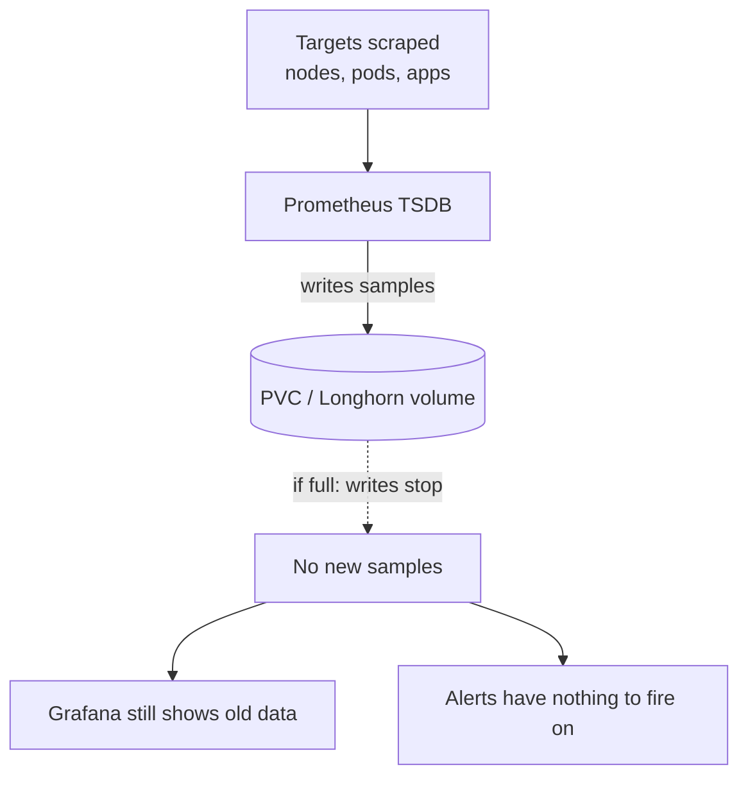

# When Prometheus Ran Out of Disk: A Homelab Monitoring Incident

The thing that watches your cluster almost went blind.

I run Prometheus for metrics and Grafana for dashboards, the standard self-hosted
monitoring stack. One morning a small scheduled health check I keep around flagged the
Prometheus data volume at **97.6% full — 48.82 GiB of a 50 GiB disk**. It was a few days
from filling completely and, worse, from *silently* stopping ingestion. This is the story of
what that means, why it's sneakier than a normal "disk full", and the GitOps gotcha that
almost left the fix half-done.

<!-- more -->

## The failure mode that hides in plain sight

Prometheus writes its time-series data to a local TSDB stored on a persistent volume
(a PVC, backed by Longhorn in my cluster). When that volume fills up, Prometheus can't
write new samples. Here's the trap: **Grafana still loads your old dashboards and the
Prometheus pod still shows as "Running."** Everything *looks* healthy — until you realize
no new data is arriving. Your alerting rules have nothing fresh to fire on. The monitoring
stack is up, but blind.

That's why a full metrics disk is scarier than a full disk anywhere else. A full media
library just stops you from adding files. A full Prometheus volume quietly disables the very
system you'd rely on to tell you something is wrong.



The health check caught it at 97.6%, before ingestion actually halted. That small margin is
the only reason this is a blog post and not a 3 a.m. "why are my alerts silent" incident.

## Two settings people constantly confuse

There are three numbers in play, and it's easy to treat them as one:

- **`retention`** (time, e.g. `14d`) — how *long* Prometheus keeps data before deleting old
  blocks.
- **`retentionSize`** (bytes, e.g. `90GB`) — a hard *size* cap on the TSDB. Prometheus
  aggressively deletes old blocks to stay under this limit.
- **`storage`** (the PVC request, e.g. `100Gi`) — the actual disk space the storage layer
  gives Prometheus.

The trap: `retentionSize` and the PVC size are **independent**. If `retentionSize` is close
to (or larger than) the PVC, Prometheus can't even hold what it's *allowed* to keep.
Originally mine was set to `retentionSize: 45GB` on a `50Gi` PVC — only ~5–7 GiB of
headroom left for the write-ahead log, compaction, and filesystem overhead. (Worth noting:
Prometheus's `retentionSize` "GB" is decimal, ~41.9 GiB, while the PVC's `50Gi` is binary,
~53.7 GB — so the gap was never a clean 5 GiB.) At my scrape volume that headroom evaporated,
and the volume climbed to 97.6%.

!!! warning "The 5 GiB nobody budgets for"
    `retentionSize` is not the only thing on the disk. Prometheus also needs room for the
    WAL and for compaction (which temporarily duplicates blocks). Always set
    `retentionSize` *comfortably* below the PVC size — a 45 GB cap on a 50 GiB volume is
    asking for trouble.

## The fix — and the GitOps gotcha

The monitoring stack is managed by GitOps (Flux reconciles a `HelmRelease` from git). The
fix was two value changes in the kube-prometheus-stack chart:

- `retentionSize`: `45GB` → `90GB`
- `storage` (the PVC request): `50Gi` → `100Gi`

I doubled the headroom rather than shrink retention, because disk is cheap and metrics
aren't — losing two weeks of history to save a few gibibytes never felt worth it.

```yaml
# kube-prometheus-stack Helm values (the relevant part)
prometheus:
  prometheusSpec:
    retention: 14d
    retentionSize: "90GB"        # hard cap on the TSDB, well under the PVC
    storageSpec:
      volumeClaimTemplate:
        spec:
          storageClassName: longhorn
          accessModes: ["ReadWriteOnce"]
          resources:
            requests:
              storage: 100Gi     # the actual disk Longhorn provisions
```

**Here's the gotcha that bit me.** The Prometheus data directory lives on a PVC created from
a *StatefulSet* `volumeClaimTemplate`. Editing that template in git and letting Flux apply it
**does not retroactively resize the existing volume.** The live PVC kept its old 50 GiB. So
the GitOps change alone would have left a 50 GiB volume with a 90 GB retention cap — exactly
the mismatch I was trying to fix, just inverted.

The live PVC has to be patched explicitly. Because the storage layer (Longhorn, via its CSI
driver with volume expansion enabled) supports online resize, this grows the volume while
Prometheus keeps running:

```bash
# 1. See how full the volume actually is
kubectl get pvc -n monitoring

# 2. Find the exact PVC name (StatefulSet-owned; verify yours with the command above)
#    It looks like: prometheus-prometheus-kube-prometheus-stack-prometheus-0
kubectl get pvc -n monitoring \
  -o custom-columns=NAME:.metadata.name,SIZE:.spec.resources.requests.storage

# 3. Bump the live request; the CSI driver expands the volume online
kubectl patch pvc prometheus-prometheus-kube-prometheus-stack-prometheus-0 \
  -n monitoring \
  -p '{"spec":{"resources":{"requests":{"storage":"100Gi"}}}}'
```

The StorageClass must allow expansion for this to work — Longhorn's does by default, but if
you're on a different backend, confirm `allowVolumeExpansion: true` on the StorageClass first.

## Verifying the fix actually landed

Patching the PVC request isn't the end — confirm the resize actually happened and ingestion
resumed:

```bash
# The request should now read 100Gi, and the actual capacity grows
kubectl get pvc -n monitoring
kubectl describe pvc prometheus-prometheus-kube-prometheus-stack-prometheus-0 -n monitoring
# Look for "FileSystemResizePending" briefly, then the new size under "Capacity"
```

Then confirm Prometheus is healthy, not just "running":

- Check the Prometheus logs for `out of space` / `segment creation failure` — there should be
  none after the resize.
- In the Prometheus UI (or a Grafana panel), query `up` and confirm targets are returning
  *current* timestamps, not frozen ones.
- Watch the health check: once usage dropped below the alert threshold, it stopped paging.

The combination of "PVC shows 100Gi" **and** "new samples are arriving" is what proves the
fix worked. Either one alone is not enough.

## Lessons learned

A few things I'd tell past-me:

- **Treat the monitoring disk as critical infrastructure.** It's the nervous system — if it
  goes blind, you lose the early-warning for *everything else*.
- **Two independent limits, not one.** `retentionSize` (what Prometheus keeps) and the PVC
  size (what the disk allows) must both fit. Set `retentionSize` comfortably below the PVC.
- **GitOps change ≠ live change for StatefulSet volumes.** Editing a `volumeClaimTemplate`
  does not resize an existing PVC. Patch the live PVC (or, if you must, delete and recreate
  the volume — which loses your history, so don't).
- **Watch your watcher.** Have *something* monitor PVC usage so the monitoring disk can't
  fill silently. The health check is what turned a near-miss into a calm Tuesday fix.
- **Prefer headroom over aggressive retention cuts.** Disk is cheap; two weeks of metrics
  history is not.

## Wrapping up

A "disk full" on your monitoring stack is one of those failures that looks fine until it
isn't — the dashboards still render, the pod is still up, and the alerts just quietly stop
firing. Budget real headroom, keep `retentionSize` well under the PVC, and remember that
the GitOps definition and the live volume are two different things.

This is part of the [Building a Self-Hosted Homelab](/) series — the previous post was
[Self-Hosting Mailpit: A Dev SMTP Catch-All and Email Preview](/self-hosting-mailpit-a-dev-smtp-catch-all-and-email-preview/).
