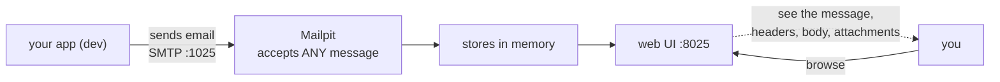
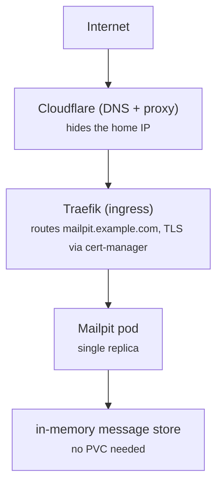

# Self-Hosting Mailpit: A Dev SMTP Catch-All and Email Preview

In the [last post](/self-hosting-ntfy-your-own-push-notification-server/) I showed a self-hosted app — ntfy — dropping into the cluster and reusing the platform services I'd already built. This one is in the same spirit but solves a different, very practical problem: **how do you test that your app actually sends the right email, without wiring up a real mail server or spamming your own inbox?**

The answer I run is [Mailpit](https://mailpit.axllent.org): a tiny SMTP server that accepts *any* message and shows it in a web inbox. Your app thinks it sent a real email; you get to read it in a browser. Nothing leaves the network.

<!-- more -->

## What problem does it solve?

Picture the loop I actually wanted:

> An app in the cluster needs to send email — a password-reset link, a welcome note, an alert — and I want to *see* that email during development, without provisioning Postfix, buying a relay, or cc'ing my real address.

The usual options are all a bit much for a homelab:

- Stand up a real mail server (Postfix, Exchange) — heavy, and you're now in the spam-deliverability business.
- Use a transactional API (SendGrid, Postmark) — needs an account, a key, and your message content leaves the network.
- Just `print()` the email — fine until you forget, and you never see the real rendered message.

Mailpit collapses all of that into one container: it pretends to be an SMTP server, catches everything sent to it, and renders the messages (HTML, plaintext, attachments) in a web UI. Your code calls SMTP like it always does; you read the result in a browser. No real delivery, no external account.

## The mental model: a fake SMTP server with a real inbox

Mailpit is, at its heart, **an SMTP server that delivers nowhere**. It accepts mail on the standard SMTP port, stores it in memory, and serves it through a web interface.



- **Send:** point your app's SMTP host at `mailpit.example.com` (or the in-cluster service) on port `1025`. No real credentials needed — it accepts any auth.
- **Read:** open the web UI on port `8025` and the message is there, usually within a second.
- **Inspect:** the UI shows the full MIME tree, rendered HTML, raw source, and downloadable attachments — exactly what you need to debug a templated email.

That's the whole interface. If it can speak SMTP, it can deliver into Mailpit.

## How it runs in my homelab

This is where the [architecture I described earlier](/how-my-3-node-k3s-homelab-actually-works/) pays off again. Mailpit is just one small pod that reuses the existing platform services:



It sits in its own namespace, has **no persistent volume** (messages live in memory and are lost on restart — which is exactly what you want for a dev catch-all), is exposed through **Traefik** with automatic TLS from **cert-manager** (the same Let's Encrypt wildcard as everything else), and Cloudflare sits in front so my home IP stays hidden.

The entire resource request is almost nothing — 50 millicores of CPU and 64 MiB of memory requested. It's one of the cheapest "services" in the cluster.

### The settings that matter

The deployment is deliberately permissive on the *SMTP* side (so any app can relay) but locked down on the *web UI* side (so strangers can't read caught mail):

```yaml
env:
  - name: MP_SMTP_AUTH_ACCEPT_ANY
    value: "1"        # accept any SMTP username/password — apps don't need real creds
  - name: MP_SMTP_AUTH_ALLOW_INSECURE
    value: "1"        # allow plaintext auth on the internal SMTP port
```

Two things are deliberately *absent* here, and both matter:

1. **No persistent storage.** The message store is in-memory by design. For a dev catch-all you *want* messages to vanish on restart, not pile up on a volume.
2. **No app-level UI password via Mailpit itself.** Mailpit *can* set its own web UI auth through an env var — but I deliberately leave that var unset and gate the UI with **Traefik `basicAuth`** instead (a Middleware referencing a Kubernetes Secret). That keeps the credentials where the rest of the cluster's auth lives, and avoids a subtle trap I'll describe next.

!!! warning "The trap that crash-loops the pod"
    Mailpit enables its *own* web UI auth the moment the `MP_UI_AUTH` env var is **set to any value** — including the tempting `"none"`. I once set `MP_UI_AUTH="none"` thinking that *disabled* auth. It did the opposite: auth turned on, `"none"` isn't valid credentials, so **every** request — including the liveness probe hitting `/` — got a `401`. The pod was healthy for a split second, failed its probe, and restarted. Indefinitely. The fix was to *omit `MP_UI_AUTH` entirely* and let Traefik's `basicAuth` be the only gate. Lesson: read what "unset" vs "set to none" means for the tool you're configuring.

## The 30-second version to try at home

You don't need a cluster to see Mailpit work. This runs the server locally with no TLS, just to feel the loop:

```bash
docker run -p 8025:8025 -p 1025:1025 axllent/mailpit:v1.30.7
```

In another terminal, send a message through it:

```bash
swaks --server localhost:1025 --from me@example.com --to you@example.com \
      --header "Subject: test from my homelab" --body "hello from Mailpit"
```

(No `swaks`? Any app or library that can send SMTP works — even `telnet localhost 1025` and typing the commands by hand.) Open `http://localhost:8025` and the message is sitting there, rendered. That's the entire product in one command.

## What I actually use it for

Several apps in the cluster are pointed at Mailpit's SMTP endpoint in their *dev* configuration:

- **car-health-check** "sends" its MOT-due and recall notifications through it during testing, so I can verify the email copy without emailing myself.
- **better-booking-bot** renders its "slot opened!" alerts into Mailpit to confirm the template before anything goes near a real recipient.
- Any new service I'm building gets Mailpit as its first SMTP target, so a bug can never accidentally fire a real email.

None of those need a real mail server. They're SMTP calls that land in an inbox only I can see. The privacy win is that *nothing* is delivered externally — there's no upstream relay at all.

## Lessons learned

A few things I'd tell past-me:

- **Accept-any SMTP is for internal dev only.** Exposing an open relay to the internet would be a spam cannon. Keep Mailpit's SMTP port internal; only the *web UI* (behind auth + Cloudflare) should be reachable.
- **Gate the UI, don't half-configure it.** A "set to none" auth var that actually *enables* auth is a footgun — put the real auth at the ingress (Traefik `basicAuth`) and leave the app var unset.
- **In-memory is a feature here.** Don't bolt a PVC onto a dev catch-all just because "storage is good" — you'll end up debugging stale messages from three restarts ago.
- **Reuse the platform.** Mailpit adds zero new infrastructure; it's one pod on top of Traefik, cert-manager, and the wildcard cert I already had.
- **Declaring a Secret isn't wiring it.** The auth Secret for the UI is generated by a helper, but if the app's kustomization never *references* that file, Flux never applies it — and the ingress then 404s even though the pod is healthy. Always reference what you create.

## Wrapping up

Mailpit is a small, high-leverage addition to a homelab. It turns "does my app send the right email?" into "open the browser and look" — without a mail server, a relay account, or a single message leaving your network. And because it just reuses Traefik, cert-manager, and the existing ingress, it slots into the cluster I already described — no new moving parts to babysit.

If you've followed along with the series, you've now seen two real apps — ntfy and Mailpit — living in the same architecture. Next time I'll go a level deeper into how Flux keeps all of this in sync from Git.

---

*This is part of the [Building a Self-Hosted Homelab](/) series — the previous post was [Self-Hosting ntfy: Your Own Push Notification Server](/self-hosting-ntfy-your-own-push-notification-server/).*
