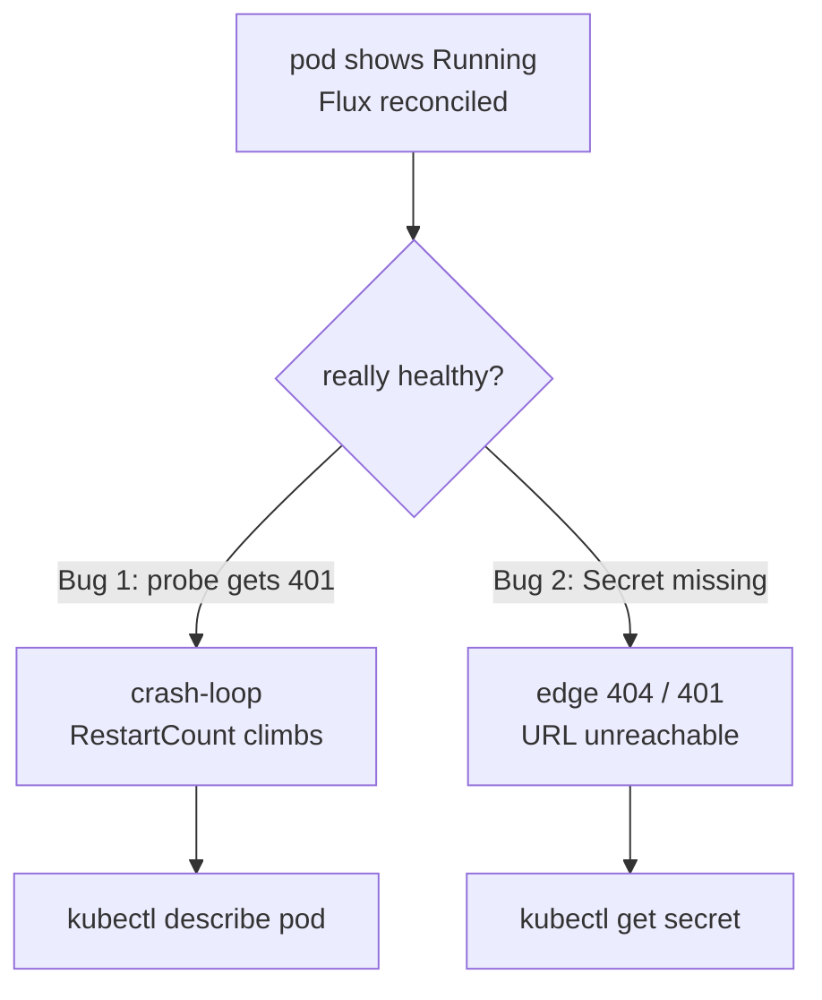

# The Mail Server That Lied: Two Bugs Behind a Green Pod

In the [last post](/how-i-locked-down-my-homelab-bot/) I wrote about tightening my bot's access. This one is about the opposite kind of mistake: the quiet, embarrassing kind where everything *looks* fine and isn't. If you read my [Self-Hosting Mailpit](/self-hosting-mailpit-a-dev-smtp-catch-all-and-email-preview/) write-up, you'll know I run a tiny dev mail server so my apps can "send email" in development without a real mail provider. I shipped it, Flux reconciled it, the dashboard said the pod was healthy — and then I actually tried to use it and found it was broken in two completely different ways.

This is that incident: what the symptoms were, how I found each root cause, and the habit I've since built so a green pod never fools me again.

<!-- more -->

## The setup, briefly

Mailpit pretends to be an SMTP server: your app connects on the standard SMTP port, Mailpit accepts the message and shows it in a web inbox. Nothing is delivered anywhere. In my cluster it sits behind the same ingress (Traefik) and TLS (cert-manager) as everything else, so it gets a real `https://mail.example.com/` URL on the LAN.

That's the background. The point of this post isn't the app — it's what went wrong *after* I declared it done.

## Everything looked fine (the lie)

Here's the trap. After merging the manifest, the signals all said "healthy":

- Flux reported the resources reconciled.
- `kubectl get pods` showed the pod `Running`.
- The ingress reported a valid certificate.

So I moved on. A day later I opened the URL to actually read a test email and got… nothing useful. Digging in, the server was broken in **two** independent ways, and neither one had shown up as an error you'd notice by glancing at the dashboard.



## Bug #1: a config flag that lied

Mailpit has an environment variable for its web UI auth, `MP_UI_AUTH`. I set it to `"none"` because — obviously — "none" means "no auth, open the inbox." It doesn't. Setting that variable *at all* switches the UI auth **on**, and `"none"` is not a valid set of credentials. So every request to the UI, including the request the liveness probe makes to decide if the pod is alive, came back `401 Unauthorized`.

The liveness probe failing is what made this nasty: Kubernetes saw the probe fail, killed the pod, started a new one, the probe failed again, and so on — an infinite crash-loop. But because the deployment *eventually* reported a pod existing, and because I wasn't watching restart counts, it looked like "a running server" from a distance.

How I actually found it:

```bash
# Restart count climbing is the tell-tale sign of a crash-loop
kubectl get pods -n <namespace>
kubectl describe pod <pod> -n <namespace>   # Liveness probe: "failed: ... 401"
kubectl logs <pod> -n <namespace> --tail=50  # 401s on every request
```

The fix was almost embarrassingly small: **delete the variable entirely** rather than set it to a fake "off" value. The default, with the variable absent, is what I actually wanted.

!!! warning "The lesson"
    Don't assume a flag's "obvious" value means what you think. `MP_UI_AUTH="none"` reads like "auth: none" but behaves like "auth: on, with broken credentials." When a setting has a name like `AUTH`, read what *presence* of the variable does, not just the value you typed. "Off" is often "the variable isn't set," not "the variable is set to `none`."

## Bug #2: the Secret that never existed

Once the pod was actually healthy, I still couldn't reach the server through its public URL — it returned a `404` at the edge. The pod was fine; the *ingress* wasn't.

The ingress uses a small middleware that needs a basic-auth Secret (a username/password for the protected URL). That Secret was generated by a helper and listed in my secrets index — but it was **never added to the app's own Kustomize resources**. Flux only applies what's actually in the rendered manifest, so the Secret was never created, and the middleware was pointing at a Secret that didn't exist. Traefik couldn't load the middleware, so the whole route failed.

This is the silent one: nothing errors at "apply" time, because the manifest is perfectly valid YAML. The failure only appears later, when the ingress controller tries to use the reference and finds nothing there.

How I found it:

```bash
# A referenced Secret that was never created
kubectl get secret <name> -n <namespace>
# -> Error from server (NotFound): secrets "<name>" not found

# And confirm the edge actually serves before trusting it
curl -sk -o /dev/null -w '%{http_code}\n' https://mail.example.com/
```

The fix was to actually wire the Secret into the app's resources so Flux would create it — not just register it in an index somewhere else.

!!! info "Registered ≠ wired"
    In GitOps, "I added the Secret to my secrets list" and "the workload can use the Secret" are two different facts. The controller applies the rendered manifest; a Secret that isn't *in* that manifest simply doesn't get created. A dangling reference is invisible until something dereferences it.

## The habit I built instead of "looks green"

Both bugs shared one root cause: I treated "the pod is Running and Flux is happy" as "it works." It doesn't mean that. Now, before I call an app done, I run a tiny checklist:

1. **Restart count.** `kubectl get pods` — is `RESTARTS` anything other than `0`? A climbing number means a crash-loop hiding behind a `Running` status.
2. **Probe status.** `kubectl describe pod` — read the Liveness/Readiness lines; a failed probe explains a lot.
3. **Referenced objects exist.** If the ingress or a pod points at a Secret/ConfigMap, `kubectl get` it and confirm it's really there.
4. **The real edge.** Actually `curl` the public URL and check for `200` *and* the content you expect — not just that DNS resolves.

None of this is hard. It's just the difference between "the deploy succeeded" and "the thing works," which are not the same sentence.

## Lessons learned

- A green pod is not proof the app works. Crash-loops and missing references both hide behind `Running`.
- "Obvious" config values lie. Read what *setting* a variable does, not just the value you typed.
- In GitOps, a registered Secret and a *wired* Secret are different objects. Verify the reference resolves.
- Trust the request, not the dashboard. `curl` the URL; `kubectl get` the Secret; read the restart count.

This was a small app and a small outage — but the shape of the mistake (healthy-looking, actually broken) is exactly the shape that bites you on something important later. The [Prometheus disk-full scare](/when-prometheus-ran-out-of-disk-a-homelab-monitoring-incident/) was the same lesson from the other direction: the metric said "fine" while the disk filled up.

---

*Part of the [Building a Self-Hosted Homelab](/hello-world/) series. The app itself is covered in [Self-Hosting Mailpit](/self-hosting-mailpit-a-dev-smtp-catch-all-and-email-preview/); this is the "what broke after I shipped it" sequel.*
