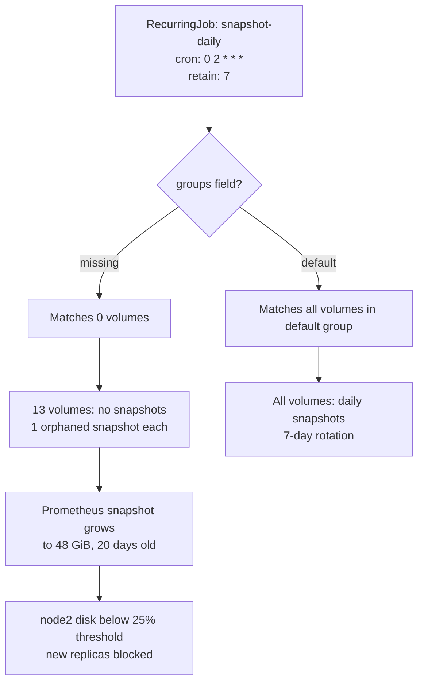

# The Snapshot Job That Looked Configured — But Wasn't

For months, I had a daily snapshot job running on my Longhorn storage. It was in git, it
was applied to the cluster, and it showed up in the Longhorn UI. It looked like everything
was being backed up. It wasn't.

One volume's snapshot grew to **48 GiB and 20 days old** before it tipped a node below
its disk threshold and blocked new workloads. The job that should have been pruning that
snapshot was a silent no-op for every volume except one.

This is the story of how a two-line YAML field caused a month of silent under-protection,
and what I'd check before trusting any "set and forget" backup job.

<!-- more -->

## What I thought was happening

I run [Longhorn](https://longhorn.io/) for distributed storage on my k3s cluster. Every
important volume — Prometheus metrics, Grafana dashboards, app databases — lives on a
Longhorn volume with replication across three nodes.

Back in May, I added a daily snapshot job:

```yaml
apiVersion: longhorn.io/v1beta2
kind: RecurringJob
metadata:
  name: snapshot-daily
  namespace: longhorn-system
spec:
  name: snapshot-daily
  cron: "0 2 * * *"
  task: snapshot
  retain: 7
  concurrency: 1
  labels:
    category: critical-data
    type: snapshot
```

The intent was simple: every volume gets a daily snapshot at 2 a.m., keeps 7 days of
snapshots, then prunes the old ones. I committed it, Flux applied it, and the Longhorn UI
showed the job existed. I moved on.

## What was actually happening

The job existed, but it wasn't attached to any volumes. In Longhorn, a `RecurringJob`
doesn't automatically apply to every volume — it only applies to volumes that are in
one of the job's `groups`. My job had **no `groups:` field at all**, which meant it
matched zero volumes.

One volume happened to be in the `default` group through a separate RecurringJob or manual attachment, so
it was correctly snapshotting and rotating at `retain: 7`. The other **13 volumes** —
including Prometheus's data volume — were getting exactly one orphaned snapshot from a
redeploy back in August, and nothing ever pruned it.



## How it surfaced

The Prometheus volume's orphaned snapshot kept growing because nothing was pruning it.
Prometheus writes metrics continuously, and Longhorn snapshots are copy-on-write — they
track every block that changes since the snapshot was taken. A snapshot that never gets
pruned and never gets replaced just keeps accumulating every write Prometheus makes.

After 20 days, that single snapshot was **48 GiB**. It pushed node2's disk usage below the
25% reserved threshold that Kubernetes uses for scheduling, and the node became
unschedulable for new replicas. The cluster was still running, but it couldn't place new
workloads on that node.

I only caught it because I was already investigating a separate Prometheus disk-full
issue (the one I wrote about in [When Prometheus Ran Out of Disk](/when-prometheus-ran-out-of-disk-a-homelab-monitoring-incident/)).
While looking at the volume, I noticed the snapshot was enormous and the snapshot job
wasn't listed as the volume's owner.

## The fix

Two lines. That's all it took:

```yaml
spec:
  name: snapshot-daily
  groups:
    - default          # <-- this was missing
  cron: "0 2 * * *"
  task: snapshot
  retain: 7
```

Adding `groups: [default]` tells Longhorn to apply this job to every volume in the
`default` group — which is where every volume lives unless you explicitly put them
elsewhere. Once applied, the job started snapshotting all 14 volumes daily and
pruning snapshots older than 7 days.

I also deleted the orphaned 48 GiB snapshot directly against the live cluster to reclaim
the space immediately, rather than waiting for the next day's prune cycle. (This was a
one-time recovery action, not a routine practice — in general, let the recurring job's
`retain` field handle pruning.)

## Why this is worse than "no backup job"

A missing backup job is obvious — you look at the cluster, you see no job, you add one.
A backup job that *looks* present but is silently doing nothing is worse because it
creates false confidence. You see the job in the UI, you see it in git, you assume
you're protected. You're not.

This is the same failure mode as a monitoring alert that's configured but not firing —
the safety net exists on paper but not in practice.

## What I'd check before trusting any backup job

A few things I'd tell past-me:

- **Verify the job actually applies to volumes.** In Longhorn, check the volume's
  details in the UI — it should list the recurring job as the snapshot owner. If the
  volume shows no job, the job isn't working.
- **Check the `groups:` field.** A `RecurringJob` with no `groups:` matches nothing.
  Either set `groups: [default]` or explicitly label your volumes to match the job.
- **Watch snapshot age and size.** A snapshot that's more than a day or two old, or
  that's growing without bound, is a sign the rotation isn't working.
- **Don't trust the UI alone.** The Longhorn UI shows the job exists — it doesn't show
  which volumes it's attached to. Cross-reference with actual volume snapshots.
- **Test a restore.** The only real proof that a backup works is restoring from it.
  A snapshot you've never restored is a hope, not a backup.

## Lessons learned

- **Silent no-ops are the worst failure mode.** A job that errors is fixable. A job
  that runs successfully but does nothing is invisible until something breaks.
- **Two lines of YAML can be the difference between protected and unprotected.** The
  `groups:` field is easy to overlook because the rest of the spec looks complete.
- **Cross-check your safety nets.** Don't assume the backup job, the monitoring alert,
  or the firewall rule is working just because it's configured. Verify it's actually
  doing what you think it's doing.
- **Orphaned snapshots are a real risk.** A snapshot that never gets pruned will grow
  until it fills the disk. Rotation is the whole point — without it, a snapshot is just
  a liability.

## Wrapping up

A backup job that looks configured but isn't is worse than no backup job at all,
because it creates false confidence. Check the `groups:` field, verify the job is
actually attached to your volumes, and watch snapshot age and size. A two-line fix
bought back a month of silent under-protection — and a reminder that "set and forget"
only works if you occasionally check that it's still set.

This is part of the Building a Self-Hosted Homelab series — the previous post was [How I Locked Down My Homelab Bot: Ambient Credentials and a Self-Granting Agent](/how-i-locked-down-my-homelab-bot/).